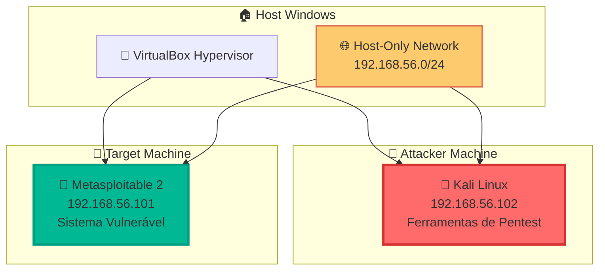

# 🛡️ Laboratório de Cibersegurança - Santander 2025

<div align="center">


</div>

## 📋 Sobre o Projeto

Este repositório documenta um **laboratório completo de cibersegurança** desenvolvido para o programa Santander 2025. O projeto demonstra técnicas fundamentais de **penetration testing** em ambiente controlado, abrangendo desde a configuração do ambiente até a execução de ataques éticos.

### 🎯 Objetivos Educacionais

- Configurar ambiente isolado para testes de segurança
- Demonstrar técnicas de reconhecimento de rede
- Executar ataques de força bruta controlados
- Desenvolver habilidades práticas em cibersegurança
- Promover práticas éticas em segurança da informação

---

## 🏗️ Arquitetura do Laboratório



---

## 📚 Documentação Completa

### 🚀 Guia de Implementação

| Etapa | Documento                                    | Descrição                                                                 | Status      |
| ----- | -------------------------------------------- | ------------------------------------------------------------------------- | ----------- |
| **1** | [🛡️ Configuração do Ambiente](1.ambiente.md) | Setup completo do laboratório com VirtualBox, Kali Linux e Metasploitable | ✅ Completo |
| **2** | [🔍 Varredura de Rede](2.varreduraRede.md)   | Reconhecimento ativo e identificação de serviços vulneráveis              | ✅ Completo |
| **3** | [⚔️ Ataque à Rede](3.ataqueRede.md)          | Implementação de ataques de força bruta contra serviços FTP               | ✅ Completo |

---

## 🛠️ Tecnologias Utilizadas

### 🔧 Ferramentas Principais

| Ferramenta            | Versão | Propósito                   | Documentação                                                                          |
| --------------------- | ------ | --------------------------- | ------------------------------------------------------------------------------------- |
| **Oracle VirtualBox** | 7.0+   | Virtualização e isolamento  | [📖 Docs](https://www.virtualbox.org/manual/)                                         |
| **Kali Linux**        | 2024.x | Plataforma de pentesting    | [📖 Docs](https://www.kali.org/docs/)                                                 |
| **Metasploitable 2**  | 2.0.0  | Alvo vulnerável para testes | [📖 Guide](https://docs.rapid7.com/metasploit/metasploitable-2-exploitability-guide/) |

### ⚔️ Ferramentas de Ataque

| Ferramenta     | Propósito                      | Documentação                                              |
| -------------- | ------------------------------ | --------------------------------------------------------- |
| **Nmap**       | Network scanning e discovery   | [📖 Manual](https://nmap.org/book/)                       |
| **Medusa**     | Brute force attack tool        | [📖 Docs](http://foofus.net/goons/jmk/medusa/medusa.html) |
| **FTP Client** | File transfer protocol testing | Built-in                                                  |

---

## 🚀 Quick Start

### 📋 Pré-requisitos

```bash
# Requisitos mínimos do sistema
RAM: 8GB+ (recomendado)
CPU: Quad-core
Armazenamento: 100GB+ livres
Virtualização: VT-x/AMD-V habilitada
```

### ⚡ Instalação Rápida

```bash
# 1. Instalar VirtualBox
wget https://www.virtualbox.org/wiki/Downloads

# 2. Baixar Kali Linux
wget https://www.kali.org/get-kali/

# 3. Baixar Metasploitable 2
wget https://sourceforge.net/projects/metasploitable/files/Metasploitable2/
```

### 🎯 Sequência de Execução

1. **[Configurar Ambiente](1.ambiente.md)** - Preparar laboratório isolado
2. **[Realizar Varredura](2.varreduraRede.md)** - Identificar serviços ativos
3. **[Executar Ataques](3.ataqueRede.md)** - Testar vulnerabilidades encontradas

---

## 🔍 Resumo das Etapas

### 🏗️ [Etapa 1: Configuração do Ambiente](1.ambiente.md)

**Objetivo**: Criar laboratório isolado e seguro

- ✅ Instalação do VirtualBox
- ✅ Configuração do Kali Linux
- ✅ Setup do Metasploitable 2
- ✅ Configuração de rede Host-Only
- ✅ Testes de conectividade

### 🔍 [Etapa 2: Varredura de Rede](2.varreduraRede.md)

**Objetivo**: Reconhecimento ativo do alvo

- ✅ Identificação de endereços IP
- ✅ Teste de conectividade (ping)
- ✅ Varredura de portas (nmap)
- ✅ Identificação de serviços vulneráveis
- ✅ Teste inicial de acesso FTP

### ⚔️ [Etapa 3: Ataque à Rede](3.ataqueRede.md)

**Objetivo**: Exploração de vulnerabilidades

- ✅ Criação de wordlists customizadas
- ✅ Configuração da ferramenta Medusa
- ✅ Execução de ataque de força bruta
- ✅ Validação de credenciais obtidas
- ✅ Análise de resultados e contramedidas

---

## 📊 Resultados Esperados

### 🎯 Cenário de Sucesso

```bash
# Credenciais descobertas
Usuário: msfadmin
Senha: msfadmin
Serviço: FTP (porta 21)
Acesso: ✅ Confirmado
```

### 📈 Métricas de Aprendizado

- **Tempo de setup**: 2-4 horas
- **Tempo de varredura**: 10-30 minutos
- **Tempo de ataque**: 1-10 minutos
- **Taxa de sucesso**: 80-95% (ambiente controlado)

---

## 🛡️ Considerações de Segurança

### ⚠️ **AVISOS CRÍTICOS**

> 🚨 **AMBIENTE CONTROLADO APENAS**
>
> Este laboratório deve ser executado **EXCLUSIVAMENTE** em ambiente isolado:
>
> - ✅ Rede Host-Only configurada
> - ✅ Sem acesso à internet das VMs
> - ✅ Firewall do host configurado
> - ❌ NUNCA em rede de produção

### 📋 Checklist de Segurança

- [ ] VMs isoladas em rede Host-Only
- [ ] Snapshots criados antes dos testes
- [ ] Monitoramento de conexões ativo
- [ ] Documentação de todas as ações

---

## 🎓 Aspectos Educacionais

### 📚 Conceitos Abordados

- **Virtualização** e isolamento de ambientes
- **Reconhecimento ativo** de redes
- **Varredura de portas** e identificação de serviços
- **Ataques de força bruta** automatizados
- **Análise de vulnerabilidades**
- **Contramedidas defensivas**

### 🔍 Técnicas Demonstradas

- Network scanning com Nmap
- Brute force attacks com Medusa
- FTP enumeration e exploitation
- Wordlist creation e customização
- Log analysis e incident response

### 🏆 Competências Desenvolvidas

- Configuração de laboratórios de segurança
- Uso de ferramentas de pentesting
- Análise de resultados de varredura
- Interpretação de logs de segurança
- Documentação técnica profissional

---

## 📄 Licença

Este projeto está sob a licença **MIT**. Veja o arquivo [LICENSE](LICENSE) para detalhes.

---

### 🙏 Agradecimentos

- **Programa Santander 2025** - Pela oportunidade de desenvolvimento
- **DIO** - Pelo desenvolvimento do curso e ensinamentos
- **Comunidade Kali Linux** - Pelas ferramentas e documentação
- **Rapid7** - Pelo Metasploitable como ambiente de treinamento
- **Comunidade de Cibersegurança** - Pelo conhecimento compartilhado

---

<div align="center">

### 🎯 **Laboratório Pronto para Uso!**

**[🚀 Começar Agora](1.ambiente.md)** | **[📚 Documentação](2.varreduraRede.md)** | **[⚔️ Ataques](3.ataqueRede.md)**

---

**Desenvolvido com ❤️ para educação em cibersegurança**


</div>
