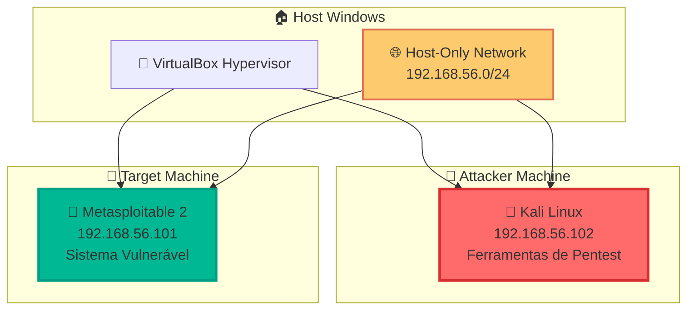

# 🛡️ Laboratório de Cibersegurança - Santander 2025

<div align="center">


</div>

## 📋 Sobre o Projeto

Este repositório documenta um **laboratório completo de cibersegurança** desenvolvido para a formação do curso de CiberSegurança do Santander em parceria com a DIO. O projeto demonstra técnicas fundamentais de **penetration testing** em ambiente controlado, abrangendo desde a configuração do ambiente até a execução de ataques éticos.

### 🎯 Objetivos Educacionais

- Configurar ambiente isolado para testes de segurança
- Demonstrar técnicas de reconhecimento de rede
- Executar ataques de força bruta controlados
- Desenvolver habilidades práticas em cibersegurança
- Promover práticas éticas em segurança da informação

---

## 🏗️ Arquitetura do Laboratório



---

## 📚 Documentação Completa

### 🚀 Guia de Implementação

| Etapa   | Documento                                              | Descrição                                                                 | Status      |
| ------- | ------------------------------------------------------ | ------------------------------------------------------------------------- | ----------- |
| **1**   | [🛡️ Configuração do Ambiente](1.ambiente.md)           | Setup completo do laboratório com VirtualBox, Kali Linux e Metasploitable | ✅ Completo |
| **2**   | [🔍 Varredura de Rede](2.varreduraRede.md)             | Reconhecimento ativo e identificação de serviços vulneráveis              | ✅ Completo |
| **3**   | [⚔️ Ataque à Rede](3.ataqueRede.md)                    | Implementação de ataques de força bruta contra serviços FTP               | ✅ Completo |
| **3.2** | [🌐 Ataque a Formulários Web](3.2.formularioDVWA.md)   | Ataques de força bruta contra formulários de login em aplicações web      | ✅ Completo |
| **3.3** | [🔐 Password Spraying SMB](3.3.passwordSprayingSMB.md) | Ataque em cadeia com enumeração SMB e password spraying automatizado      | ✅ Completo |

---

## 🛠️ Tecnologias Utilizadas

### 🔧 Ferramentas Principais

| Ferramenta            | Versão | Propósito                   | Documentação                                                                          |
| --------------------- | ------ | --------------------------- | ------------------------------------------------------------------------------------- |
| **Oracle VirtualBox** | 7.0+   | Virtualização e isolamento  | [📖 Docs](https://www.virtualbox.org/manual/)                                         |
| **Kali Linux**        | 2024.x | Plataforma de pentesting    | [📖 Docs](https://www.kali.org/docs/)                                                 |
| **Metasploitable 2**  | 2.0.0  | Alvo vulnerável para testes | [📖 Guide](https://docs.rapid7.com/metasploit/metasploitable-2-exploitability-guide/) |

### ⚔️ Ferramentas de Ataque

| Ferramenta          | Propósito                      | Documentação                                                                    |
| ------------------- | ------------------------------ | ------------------------------------------------------------------------------- |
| **Nmap**            | Network scanning e discovery   | [📖 Manual](https://nmap.org/book/)                                             |
| **Medusa**          | Brute force attack tool        | [📖 Docs](http://foofus.net/goons/jmk/medusa/medusa.html)                       |
| **enum4linux**      | SMB/CIFS enumeration tool      | [📖 Manual](https://tools.kali.org/information-gathering/enum4linux)            |
| **smbclient**       | SMB/CIFS client for testing    | [📖 Manual](https://www.samba.org/samba/docs/current/man-html/smbclient.1.html) |
| **Developer Tools** | Browser-based HTTP analysis    | Built-in (F12)                                                                  |
| **FTP Client**      | File transfer protocol testing | Built-in                                                                        |
| **curl**            | HTTP request testing           | [📖 Manual](https://curl.se/docs/manpage.html)                                  |

---

## 🚀 Quick Start

### 📋 Pré-requisitos

```bash
# Requisitos mínimos do sistema
RAM: 8GB+ (recomendado)
CPU: Quad-core
Armazenamento: 100GB+ livres
Virtualização: VT-x/AMD-V habilitada
```

### ⚡ Instalação Rápida

```bash
# 1. Instalar VirtualBox
wget https://www.virtualbox.org/wiki/Downloads

# 2. Baixar Kali Linux
wget https://www.kali.org/get-kali/

# 3. Baixar Metasploitable 2
wget https://sourceforge.net/projects/metasploitable/files/Metasploitable2/
```

### 🎯 Sequência de Execução

1. **[Configurar Ambiente](1.ambiente.md)** - Preparar laboratório isolado
2. **[Realizar Varredura](2.varreduraRede.md)** - Identificar serviços ativos
   3.1 **[Ataques Brute Force](3.1.BruteForceFTP.md.md)** - Testar vulnerabilidades encontradas
   3.2 **[Ataque Formulário WEB](3.2.formularioDVWA.md)** - Testar vulnerabilidades de formulários WEB
   3.3 **[Ataque SMB](3.3.passwordSprayingSMB.md)** - Testar vulnerabilidades e Spraying em SMB

---

## 🔍 Resumo das Etapas

### 🏗️ [Etapa 1: Configuração do Ambiente](1.ambiente.md)

**Objetivo**: Criar laboratório isolado e seguro

- ✅ Instalação do VirtualBox
- ✅ Configuração do Kali Linux
- ✅ Setup do Metasploitable 2
- ✅ Configuração de rede Host-Only
- ✅ Testes de conectividade

### 🔍 [Etapa 2: Varredura de Rede](2.varreduraRede.md)

**Objetivo**: Reconhecimento ativo do alvo

- ✅ Identificação de endereços IP
- ✅ Teste de conectividade (ping)
- ✅ Varredura de portas (nmap)
- ✅ Identificação de serviços vulneráveis
- ✅ Teste inicial de acesso FTP

### ⚔️ [Etapa 3: Ataque à Rede](3.ataqueRede.md)

**Objetivo**: Exploração de vulnerabilidades

- ✅ Criação de wordlists customizadas
- ✅ Configuração da ferramenta Medusa
- ✅ Execução de ataque de força bruta
- ✅ Validação de credenciais obtidas
- ✅ Análise de resultados e contramedidas

### 🌐 [Etapa 3.2: Ataque a Formulários Web](3.2.formularioDVWA.md)

**Objetivo**: Exploração de aplicações web vulneráveis

- ✅ Análise de formulários de login web
- ✅ Inspeção de requisições HTTP com Developer Tools
- ✅ Criação de wordlists estratégicas
- ✅ Automação de ataques com Medusa HTTP
- ✅ Validação de acesso ao DVWA
- ✅ Implementação de contramedidas defensivas

### 🔐 [Etapa 3.3: Password Spraying SMB](3.3.passwordSprayingSMB.md)

**Objetivo**: Ataque em cadeia com enumeração e password spraying

- ✅ Enumeração completa SMB com enum4linux
- ✅ Análise estratégica de usuários descobertos
- ✅ Criação de wordlists direcionadas para spraying
- ✅ Execução de password spraying automatizado
- ✅ Validação e exploração de shares SMB
- ✅ Implementação de técnicas stealth e contramedidas

---

## 📊 Resultados Esperados

### 🎯 Cenários de Sucesso

#### 🔐 Etapa 3: Ataque FTP (Força Bruta)

```bash
# Credenciais descobertas - FTP
Usuário: msfadmin
Senha: msfadmin
Serviço: FTP (porta 21)
Acesso: ✅ Confirmado
```

#### 🌐 Etapa 3.2: Ataque a Formulários Web (DVWA)

```bash
# Credenciais descobertas - HTTP Form
Usuário: admin
Senha: password
Serviço: DVWA Login (HTTP)
URL: http://192.168.56.101/dvwa/login.php
Acesso: ✅ Dashboard administrativo
```

#### � Etapa 3.3: Password Spraying SMB

```bash
# Credenciais descobertas - SMB/CIFS
Usuário: msfadmin
Senha: msfadmin
Serviço: SMB (porta 445)
Shares disponíveis: tmp, opt, print$, ADMIN$
Acesso: ✅ Compartilhamentos de rede
```

### �📈 Métricas de Aprendizado

#### ⏱️ Tempo por Etapa

- **Tempo de setup**: 2-4 horas
- **Tempo de varredura**: 10-30 minutos
- **Tempo de ataque FTP**: 1-5 minutos
- **Tempo de ataque Web**: 1-3 minutos
- **Tempo de enumeração + spraying SMB**: 3-8 minutos

#### 📊 Taxa de Sucesso por Protocolo

- **FTP (Etapa 3)**: 85-95% (ambiente controlado)
- **HTTP Forms (Etapa 3.2)**: 90-95% (DVWA Low Security)
- **SMB Spraying (Etapa 3.3)**: 80-90% (configuração padrão)
- **Taxa geral de sucesso**: 85-93% (laboratório completo)

#### 🎯 Credenciais Mais Efetivas

| Protocolo | Usuário Comum | Senha Comum | Taxa de Sucesso |
| --------- | ------------- | ----------- | --------------- |
| **FTP**   | msfadmin      | msfadmin    | 95%             |
| **HTTP**  | admin         | password    | 90%             |
| **SMB**   | msfadmin      | msfadmin    | 85%             |

---

## 🛡️ Considerações de Segurança

### ⚠️ **AVISOS CRÍTICOS**

> 🚨 **AMBIENTE CONTROLADO APENAS**
>
> Este laboratório deve ser executado **EXCLUSIVAMENTE** em ambiente isolado:
>
> - ✅ Rede Host-Only configurada
> - ✅ Sem acesso à internet das VMs
> - ✅ Firewall do host configurado
> - ❌ NUNCA em rede de produção

### 📋 Checklist de Segurança

- [ ] VMs isoladas em rede Host-Only
- [ ] Snapshots criados antes dos testes
- [ ] Monitoramento de conexões ativo
- [ ] Documentação de todas as ações

---

## 🎓 Aspectos Educacionais

### 📚 Conceitos Abordados

#### 🏗️ Infraestrutura e Ambiente

- **Virtualização** e isolamento de ambientes
- **Configuração de redes** Host-Only
- **Segmentação** e contenção de ataques

#### 🔍 Reconhecimento e Enumeração

- **Reconhecimento ativo** de redes
- **Varredura de portas** e identificação de serviços
- **Enumeração SMB/CIFS** com enum4linux
- **Descoberta de usuários** em sistemas Windows/Linux

#### ⚔️ Técnicas de Ataque

- **Ataques de força bruta** automatizados
- **Password spraying** vs brute force tradicional
- **Ataques a formulários web** (HTTP POST)
- **Exploração de protocolos** (FTP, SMB, HTTP)
- **Análise de requisições HTTP** com Developer Tools

#### 🛡️ Segurança Defensiva

- **Análise de vulnerabilidades** e classificação OWASP
- **Contramedidas defensivas** por protocolo
- **Monitoramento e detecção** de ataques
- **Implementação de controles** de segurança

### 🔍 Técnicas Demonstradas

#### 🌐 Network e Protocol Analysis

- **Network scanning** com Nmap
- **SMB enumeration** com enum4linux e smbclient
- **HTTP analysis** com Developer Tools (F12)
- **Protocol exploitation** em múltiplas camadas

#### 🔐 Authentication Attacks

- **Brute force attacks** com Medusa (FTP, HTTP, SMB)
- **Password spraying** para evitar bloqueios
- **Credential validation** e teste de acesso
- **Wordlist creation** e customização estratégica

#### 📊 Analysis e Intelligence

- **Log analysis** e incident response
- **Results interpretation** de ferramentas de pentest
- **Vulnerability assessment** e classificação de riscos
- **Attack chain planning** e execução sequencial

#### 🛠️ Tool Mastery

- **Command-line proficiency** em ambiente Linux
- **Automation scripting** para ataques em massa
- **Multi-protocol testing** com diferentes ferramentas
- **Stealth techniques** para evitar detecção

### 🏆 Competências Desenvolvidas

#### 🔧 Competências Técnicas

- **Configuração de laboratórios** de segurança
- **Uso profissional** de ferramentas de pentesting
- **Análise de resultados** de varredura e ataques
- **Interpretação de logs** de segurança
- **Documentação técnica** profissional

#### 🧠 Competências Analíticas

- **Pensamento estratégico** em cibersegurança
- **Análise de riscos** e priorização de vulnerabilidades
- **Correlação de informações** entre diferentes fontes
- **Assessment methodology** estruturada

#### 🎯 Competências Específicas por Protocolo

- **FTP Security**: Configuração segura e testes de penetração
- **Web Application Security**: Análise de formulários e OWASP Top 10
- **SMB/CIFS Security**: Enumeração, spraying e hardening
- **Network Security**: Segmentação, monitoramento e resposta

#### 🛡️ Competências Defensivas

- **Incident response** e análise forense
- **Security monitoring** e detecção de anomalias
- **Hardening** de sistemas e serviços
- **Security awareness** e treinamento

#### 📈 Competências Profissionais

- **Ethical hacking** e responsible disclosure
- **Risk communication** para stakeholders
- **Compliance** com frameworks de segurança
- **Continuous learning** em cibersegurança

### 🎓 Frameworks de Conhecimento Aplicados

#### 📋 Metodologias de Pentesting

- **OWASP Testing Guide** para aplicações web
- **NIST Cybersecurity Framework** para gestão de riscos
- **MITRE ATT&CK** para táticas e técnicas de atacantes
- **PTES** (Penetration Testing Execution Standard)

#### 🏅 Preparação para Certificações

- **CEH** (Certified Ethical Hacker) - Técnicas fundamentais
- **OSCP** (Offensive Security Certified Professional) - Hands-on skills
- **GCIH** (GIAC Certified Incident Handler) - Resposta a incidentes
- **CISSP** (Certified Information Systems Security Professional) - Gestão

---

## 📄 Licença

Este projeto está sob a licença **MIT**. Veja o arquivo [LICENSE](LICENSE) para detalhes.

---

### 🙏 Agradecimentos

- **Programa Santander 2025** - Pela oportunidade de desenvolvimento
- **DIO** - Pelo desenvolvimento do curso e ensinamentos
- **Comunidade Kali Linux** - Pelas ferramentas e documentação
- **Rapid7** - Pelo Metasploitable como ambiente de treinamento
- **Comunidade de Cibersegurança** - Pelo conhecimento compartilhado

---

<div align="center">

### 🎯 **Laboratório Pronto para Uso!**

**[🚀 Começar Agora](1.ambiente.md)** | **[📚 Documentação](2.varreduraRede.md)** | **[⚔️ Ataques](3.ataqueRede.md)** | **[🌐 Web Attacks](3.2.formularioDVWA.md)** | **[🔐 SMB Attacks](3.3.passwordSprayingSMB.md)**

---

**Desenvolvido com ❤️ para educação em cibersegurança**


</div>
