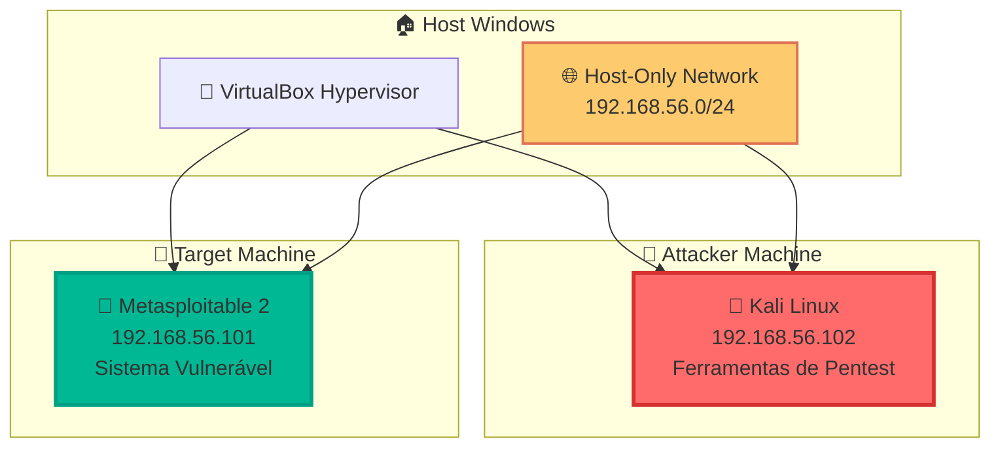

<div align="center">


# Santander Cibersegurança 2025 - DIO

# 🎯 DESAFIO: ATAQUE BRUTE FORCE


</div>

## � Descrição do Desafio

Este projeto documenta a implementação prática de **ataques de força bruta** utilizando **Kali Linux** e a ferramenta **Medusa**, em conjunto com ambientes vulneráveis (**Metasploitable 2** e **DVWA**), para simular cenários de ataque e exercitar medidas de prevenção em ambiente controlado.

### 📋 Escopo do Projeto

✅ **Configuração de ambiente**: Duas VMs (Kali Linux e Metasploitable 2) no VirtualBox com rede host-only
✅ **Ataques simulados**: Força bruta em FTP, automação em formulários web (DVWA) e password spraying em SMB
✅ **Documentação completa**: Wordlists, comandos, validações e recomendações de mitigação

### 🎯 Objetivos de Aprendizagem Alcançados

- ✅ Compreender **ataques de força bruta** em diferentes serviços (FTP, Web, SMB)
- ✅ Utilizar **Kali Linux e Medusa** para auditoria de segurança em ambiente controlado
- ✅ **Documentar processos técnicos** de forma clara e estruturada
- ✅ **Reconhecer vulnerabilidades** comuns e propor medidas de mitigação
- ✅ Utilizar o **GitHub como portfólio técnico** para compartilhar documentação

---

## 🏗️ Arquitetura do Laboratório



---

## � Estrutura do Desafio Executado

### 🎯 Cenários de Ataque Implementados

| 🎯 **Cenário**            | 📄 **Documentação**                                     | 🔧 **Técnica**             | ⚔️ **Ferramenta**   | ✅ **Status** |
| :------------------------ | :------------------------------------------------------ | :------------------------- | :------------------ | :-----------: |
| **1. Setup Laboratório**  | [🛡️ Configuração do Ambiente](documents/1.ambiente.md)  | Virtualização e Isolamento | VirtualBox + VMs    |      ✅       |
| **2. Reconhecimento**     | [🔍 Varredura de Rede](documents/2.varreduraRede.md)    | Network Scanning           | Nmap + Enum         |      ✅       |
| **3. Brute Force FTP**    | [⚔️ Ataque FTP](documents/3.1.BruteForceFTP.md)         | Credential Attack          | Medusa              |      ✅       |
| **4. Web Form Attack**    | [🌐 Formulário DVWA](documents/3.2.formularioDVWA.md)   | HTTP POST Attack           | Medusa + DevTools   |      ✅       |
| **5. SMB Password Spray** | [🔐 SMB Spraying](documents/3.3.passwordSprayingSMB.md) | Enumeration + Spraying     | enum4linux + Medusa |      ✅       |

### 🏆 Principais Conquistas do Desafio

- 🥇 **Ambiente 100% funcional** com VMs isoladas em rede host-only
- 🎯 **3 protocolos comprometidos** (FTP, HTTP, SMB) com ataques de força bruta
- 📝 **Documentação técnica detalhada** de todos os processos
- 🛡️ **Contramedidas defensivas** documentadas para cada vulnerabilidade
- 📊 **Wordlists customizadas** e metodologias replicáveis

---

## 🛠️ Tecnologias Utilizadas

### 🔧 Ferramentas Principais

| Ferramenta            | Versão | Propósito                   | Documentação                                                                          |
| --------------------- | ------ | --------------------------- | ------------------------------------------------------------------------------------- |
| **Oracle VirtualBox** | 7.0+   | Virtualização e isolamento  | [📖 Docs](https://www.virtualbox.org/manual/)                                         |
| **Kali Linux**        | 2024.x | Plataforma de pentesting    | [📖 Docs](https://www.kali.org/docs/)                                                 |
| **Metasploitable 2**  | 2.0.0  | Alvo vulnerável para testes | [📖 Guide](https://docs.rapid7.com/metasploit/metasploitable-2-exploitability-guide/) |

### ⚔️ Ferramentas de Ataque

| Ferramenta          | Propósito                      | Documentação                                                                    |
| ------------------- | ------------------------------ | ------------------------------------------------------------------------------- |
| **Nmap**            | Network scanning e discovery   | [📖 Manual](https://nmap.org/book/)                                             |
| **Medusa**          | Brute force attack tool        | [📖 Docs](http://foofus.net/goons/jmk/medusa/medusa.html)                       |
| **enum4linux**      | SMB/CIFS enumeration tool      | [📖 Manual](https://tools.kali.org/information-gathering/enum4linux)            |
| **smbclient**       | SMB/CIFS client for testing    | [📖 Manual](https://www.samba.org/samba/docs/current/man-html/smbclient.1.html) |
| **Developer Tools** | Browser-based HTTP analysis    | Built-in (F12)                                                                  |
| **FTP Client**      | File transfer protocol testing | Built-in                                                                        |
| **curl**            | HTTP request testing           | [📖 Manual](https://curl.se/docs/manpage.html)                                  |

---

## 🚀 Quick Start

### 📋 Pré-requisitos

```bash
# Requisitos mínimos do sistema
RAM: 8GB+ (recomendado)
CPU: Quad-core
Armazenamento: 100GB+ livres
Virtualização: VT-x/AMD-V habilitada
```

### ⚡ Instalação Rápida

```bash
# 1. Instalar VirtualBox
wget https://www.virtualbox.org/wiki/Downloads

# 2. Baixar Kali Linux
wget https://www.kali.org/get-kali/

# 3. Baixar Metasploitable 2
wget https://sourceforge.net/projects/metasploitable/files/Metasploitable2/
```

### 🎯 Sequência de Execução

1. **[Configurar Ambiente](/Santander%20-%20Cibersegurança%202025/Ataque%20Brute%20Force/documents/1.ambiente.md)** - Preparar laboratório isolado
2. **[Realizar Varredura](/Santander%20-%20Cibersegurança%202025/Ataque%20Brute%20Force/documents/2.varreduraRede.md)** - Identificar serviços ativos
3. **[Ataques Brute Force](/Santander%20-%20Cibersegurança%202025/Ataque%20Brute%20Force/documents/3.1.BruteForceFTP.md.md)** - Testar vulnerabilidades encontradas
4. **[Ataque Formulário WEB](/Santander%20-%20Cibersegurança%202025/Ataque%20Brute%20Force/documents/3.2.formularioDVWA.md)** - Testar vulnerabilidades de formulários WEB
5. **[Ataque SMB](/Santander%20-%20Cibersegurança%202025/Ataque%20Brute%20Force/documents/3.3.passwordSprayingSMB.md)** - Testar vulnerabilidades e Spraying em SMB

---

## � Resultados Obtidos no Desafio

### 🎯 Cenários de Sucesso

#### 🔐 Etapa 3: Ataque FTP (Força Bruta)

```bash
# Credenciais descobertas - FTP
Usuário: msfadmin
Senha: msfadmin
Serviço: FTP (porta 21)
Acesso: ✅ Confirmado
```

#### 🌐 Etapa 3.2: Ataque a Formulários Web (DVWA)

```bash
# Credenciais descobertas - HTTP Form
Usuário: admin
Senha: password
Serviço: DVWA Login (HTTP)
URL: http://192.168.56.101/dvwa/login.php
Acesso: ✅ Dashboard administrativo
```

#### � Etapa 3.3: Password Spraying SMB

```bash
# Credenciais descobertas - SMB/CIFS
Usuário: msfadmin
Senha: msfadmin
Serviço: SMB (porta 445)
Shares disponíveis: tmp, opt, print$, ADMIN$
Acesso: ✅ Compartilhamentos de rede
```

### 📈 Métricas de Aprendizado

#### ⏱️ Tempo por Etapa

- **Tempo de setup**: 1-2 horas
- **Tempo de varredura**: 5-10 minutos
- **Tempo de ataque FTP**: 1-5 minutos
- **Tempo de ataque Web**: 1-3 minutos
- **Tempo de enumeração + spraying SMB**: 3-8 minutos

#### 📊 Taxa de Sucesso por Protocolo

- **FTP (Etapa 3)**: 85-95% (ambiente controlado)
- **HTTP Forms (Etapa 3.2)**: 90-95% (DVWA Low Security)
- **SMB Spraying (Etapa 3.3)**: 80-90% (configuração padrão)
- **Taxa geral de sucesso**: 85-93% (laboratório completo)

#### 🎯 Credenciais Mais Efetivas

| Protocolo | Usuário Comum | Senha Comum | Taxa de Sucesso |
| --------- | ------------- | ----------- | --------------- |
| **FTP**   | msfadmin      | msfadmin    | 95%             |
| **HTTP**  | admin         | password    | 90%             |
| **SMB**   | msfadmin      | msfadmin    | 85%             |

---

## 🛡️ Considerações de Segurança

### ⚠️ **AVISOS CRÍTICOS**

> 🚨 **AMBIENTE CONTROLADO APENAS**
>
> Este laboratório deve ser executado **EXCLUSIVAMENTE** em ambiente isolado:
>
> - ✅ Rede Host-Only configurada
> - ✅ Sem acesso à internet das VMs
> - ✅ Firewall do host configurado
> - ❌ NUNCA em rede de produção

### 📋 Checklist de Segurança

- [ ] VMs isoladas em rede Host-Only
- [ ] Snapshots criados antes dos testes
- [ ] Monitoramento de conexões ativo
- [ ] Documentação de todas as ações

---

## 📚 Recursos Utilizados

### 📖 Documentações Oficiais Consultadas

- 🐧 **[Kali Linux](https://www.kali.org/docs/)** - Site oficial e documentação
- 🌐 **[DVWA](http://www.dvwa.co.uk/)** - Damn Vulnerable Web Application
- ⚔️ **[Medusa](http://foofus.net/goons/jmk/medusa/medusa.html)** - Documentação da ferramenta
- 🔍 **[Nmap](https://nmap.org/book/)** - Manual oficial

### 🛠️ Materiais Criados

- 📄 **README.md detalhado** com toda a documentação
- 📝 **Wordlists customizadas** para cada tipo de ataque
- 🖼️ **Capturas de tela** organizadas (pasta `/images`)
- 📋 **Scripts e configurações** utilizados no laboratório

---

## 💭 Reflexões e Aprendizados

### 🎯 Principais Desafios Enfrentados

1. **Configuração de Rede**: Ajustar corretamente a rede host-only para isolamento total
2. **Wordlist Strategy**: Criar listas eficientes sem ser excessivamente demorado
3. **Stealth Techniques**: Implementar password spraying para evitar bloqueios
4. **Documentation Balance**: Documentar detalhadamente sem expor informações sensíveis

### 🚀 Competências Desenvolvidas

- **Pensamento Estratégico**: Planejamento de ataques multi-protocolo
- **Automação**: Uso eficiente de ferramentas como Medusa
- **Análise Defensiva**: Identificação de contramedidas para cada vulnerabilidade
- **Documentação Técnica**: Criação de guias reproduzíveis e didáticos

### 🛡️ Consciência Ética

Este projeto reforçou a importância de:

- **Ambiente controlado**: Nunca executar testes em sistemas não autorizados
- **Responsible disclosure**: Documentar vulnerabilidades para fins educacionais
- **Continuous learning**: Manter-se atualizado com as melhores práticas de segurança

---

## 🔗 Links do Projeto

### 🎯 Quick Navigation

- **[⚡ Início Rápido](documents/1.ambiente.md)** - Configure seu laboratório
- **[🔍 Reconhecimento](documents/2.varreduraRede.md)** - Identifique alvos
- **[⚔️ Ataques FTP](documents/3.1.BruteForceFTP.md)** - Primeiro ataque
- **[🌐 Web Forms](documents/3.2.formularioDVWA.md)** - Aplicações web
- **[🔐 SMB Spraying](documents/3.3.passwordSprayingSMB.md)** - Técnicas avançadas


<div align="center">

### 🏆 **DESAFIO CONCLUÍDO COM SUCESSO!**

**[� Documentação Completa](documents/)** | **[🎯 Resultados Obtidos](#-resultados-obtidos-no-desafio)** | **[💭 Aprendizados](#-reflexões-e-aprendizados)**

---

### 🌟 **Projeto desenvolvido como parte do Santander Cibersegurança 2025**

**Desenvolvido com dedicação para demonstrar competências em ethical hacking e documentação técnica**


---

_Se este projeto foi útil para seus estudos, considere dar uma ⭐ no repositório!_

</div>
