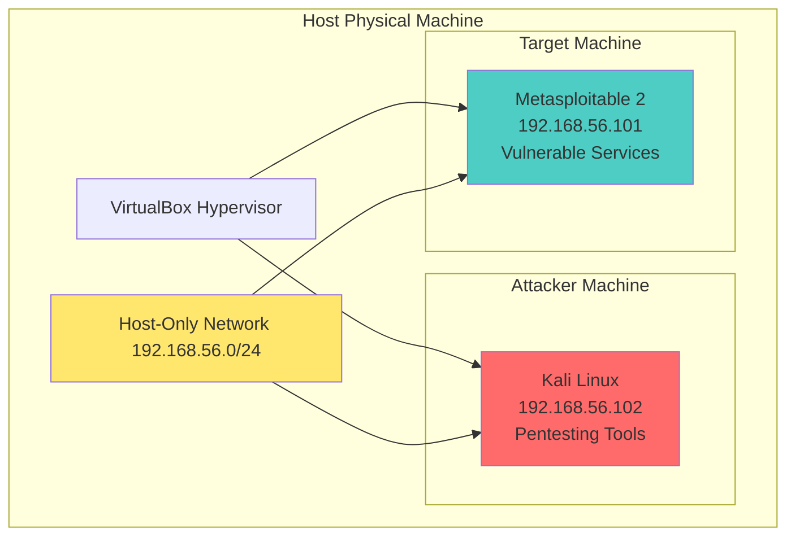

# 🛡️ Etapa 1: Configuração do Ambiente de Laboratório

## 📋 Objetivo

Configurar um ambiente isolado e seguro para testes de penetração utilizando virtualização, garantindo que todas as atividades de cibersegurança sejam realizadas de forma controlada e sem riscos para sistemas de produção.

## 🏗️ Arquitetura do Laboratório



---

## 💻 Passo 1: Instalação do Oracle VirtualBox

### 🎯 Por que VirtualBox?

- **Gratuito e Open Source**: Sem custos de licenciamento
- **Multiplataforma**: Windows, macOS, Linux
- **Recursos avançados**: Snapshots, clonagem, redes isoladas
- **Ampla compatibilidade**: Suporte a diversos sistemas operacionais

### 📥 Download e Instalação

#### 1. Download

```bash
# Site oficial
https://www.virtualbox.org/wiki/Downloads
```

#### 2. Versões Recomendadas

| Sistema | Versão Mínima | Recomendada       |
| ------- | ------------- | ----------------- |
| Windows | 6.1.x         | 7.0.x ou superior |
| macOS   | 6.1.x         | 7.0.x ou superior |
| Linux   | 6.1.x         | 7.0.x ou superior |

#### 3. Requisitos do Sistema

| Componente        | Requisito Mínimo      | Recomendado       |
| ----------------- | --------------------- | ----------------- |
| **RAM**           | 4GB                   | 8GB+              |
| **CPU**           | Dual-core             | Quad-core+        |
| **Armazenamento** | 50GB livres           | 100GB+            |
| **Virtualização** | VT-x/AMD-V habilitada | VT-x/AMD-V + VT-d |

### ⚙️ Configuração Pós-Instalação

#### 1. Verificação da Instalação

- Abrir VirtualBox Manager
- Verificar versão em **Ajuda > Sobre**
- Confirmar Extension Pack instalado

#### 2. Configurações Globais Recomendadas

```bash
# Configurações > Geral
- Pasta padrão de VMs: [Local com espaço suficiente]
- Biblioteca VRDP: Habilitada

# Configurações > Entrada
- Captura automática do teclado: Desabilitada
- Host Key: Right Ctrl (padrão)
```

---

## 🐉 Passo 2: Configuração do Kali Linux

### 🎯 Por que Kali Linux?

- **Distribuição especializada** em segurança ofensiva
- **400+ ferramentas** pré-instaladas
- **Atualizações constantes** de ferramentas
- **Comunidade ativa** e documentação extensa

### 📥 Download da Imagem

#### URLs Oficiais

```bash
# Download principal
https://www.kali.org/get-kali/

# Imagem recomendada
Kali Linux 2024.x VMware/VirtualBox (64-Bit) - .ova file
```

### 🔧 Configuração da VM Kali

#### 1. Criação da Máquina Virtual

```bash
Nome: Kali-Linux-Pentest
Tipo: Linux
Versão: Debian (64-bit)
Localização: [Pasta dedicada ao laboratório]
```

#### 2. Especificações Recomendadas

| Recurso   | Mínimo  | Recomendado | Explicação                     |
| --------- | ------- | ----------- | ------------------------------ |
| **RAM**   | 2GB     | 4GB+        | Ferramentas consomem memória   |
| **CPU**   | 2 cores | 4 cores     | Paralelização de ataques       |
| **Disco** | 20GB    | 40GB+       | Espaço para logs e ferramentas |
| **Vídeo** | 64MB    | 128MB       | Interface gráfica fluida       |

#### 3. Configurações Específicas

```bash
# Sistema > Placa-mãe
✅ Habilitar I/O APIC
✅ Habilitar EFI
✅ Relógio da VM em UTC

# Sistema > Processador
✅ Habilitar PAE/NX
✅ Habilitar VT-x/AMD-V aninhado

# Armazenamento
✅ Controladora SATA
✅ Disco SSD (se disponível)
✅ Cache de E/S: Host
```

### 🚀 Instalação e Configuração Inicial

#### 1. Processo de Instalação

```bash
# Opções recomendadas durante instalação
- Linguagem: Português (melhor compreensão)
- Localização: Sua região
- Teclado: Seu layout
- Hostname: kali
- Domínio: localdomain
- Usuário: kali (padrão)
- Senha: [senha forte personalizada]
```

---

## 🎯 Passo 3: Configuração do Metasploitable 2

### 🎯 Por que Metasploitable 2?

- **Intencionalmente vulnerável**: Projetado para treinamento
- **Múltiplas vulnerabilidades**: Diferentes vetores de ataque
- **Bem documentado**: Exploits conhecidos e catalogados
- **Ambiente seguro**: Isolado da rede principal

### 📥 Download e Preparação

#### 1. Download Oficial

```bash
# Source Forge (oficial)
https://sourceforge.net/projects/metasploitable/files/Metasploitable2/

# Arquivo recomendado
metasploitable-linux-2.0.0.zip (841MB)
```

### 🔧 Configuração da VM Metasploitable

#### 1. Especificações da VM

```bash
Nome: Metasploitable2-Target
Tipo: Linux
Versão: Ubuntu (64-bit)
```

#### 2. Recursos Necessários

| Recurso   | Configuração   | Justificativa                    |
| --------- | -------------- | -------------------------------- |
| **RAM**   | 512MB          | Sistema leve, poucos recursos    |
| **CPU**   | 1 core         | Suficiente para serviços básicos |
| **Disco** | VMDK existente | Usar arquivo baixado             |
| **Rede**  | Host-Only      | Isolamento de segurança          |

#### 3. Importação do VMDK

```bash
# Extrair arquivo baixado
unzip metasploitable-linux-2.0.0.zip

# No VirtualBox
1. Novo > Metasploitable2-Target
2. Armazenamento > Usar disco existente
3. Selecionar: Metasploitable.vmdk
4. Finalizar criação
```

### 🔑 Credenciais Padrão

```bash
# Login SSH/Console
Usuário: msfadmin
Senha: msfadmin
```

---

## 🌐 Passo 4: Configuração de Rede Host-Only

### 🎯 Objetivos da Rede Isolada

- **Isolamento total**: VMs não acessam internet
- **Comunicação interna**: VMs se comunicam entre si
- **Acesso do host**: Host pode acessar as VMs
- **Segurança**: Nenhum tráfego sai do ambiente

### 🔧 Configuração do VirtualBox

#### 1. Configuração das VMs

##### Kali Linux

```bash
# VM Kali > Configurações > Rede
Adaptador 1:
✅ Habilitar placa de rede
✅ Conectado a: Rede apenas do Host
✅ Nome: vboxnet0
✅ Tipo do adaptador: Intel PRO/1000 MT Desktop
```

##### Metasploitable 2

```bash
# VM Metasploitable > Configurações > Rede
Adaptador 1:
✅ Habilitar placa de rede
✅ Conectado a: Rede apenas do Host
✅ Nome: vboxnet0
✅ Tipo do adaptador: Intel PRO/1000 MT Desktop
```

### 🔍 Verificação da Configuração de Rede

#### 1. Teste no Kali Linux

```bash
# Verificar interface de rede
ifconfig

# Resultado esperado
eth0: 192.168.56.102/24

# Teste de conectividade
ping -c 3 192.168.56.101    # Metasploitable
```

#### 2. Teste no Metasploitable

```bash
# Login: msfadmin / msfadmin
ifconfig

# Resultado esperado
eth0: 192.168.56.101/24

# Teste de conectividade
ping -c 3 192.168.56.102    # Kali
```

---

## 🛡️ Considerações de Segurança

### ⚠️ **AVISOS CRÍTICOS**

#### 🚨 Isolamento Obrigatório

> **NUNCA** conecte o Metasploitable à internet ou rede de produção
>
> - Sistema intencionalmente vulnerável
> - Pode ser comprometido instantaneamente
> - Use **APENAS** em rede Host-Only


### 📋 Checklist de Segurança

- [ ] VMs configuradas em rede Host-Only
- [ ] Acesso à internet das VMs bloqueado
- [ ] Firewall do host configurado
- [ ] Snapshots criados antes dos testes
- [ ] Senhas das VMs alteradas das padrões
- [ ] Acesso SSH restrito por IP

---

## 🎯 Próximos Passos

### ✅ Validação Final do Ambiente

```bash
# Checklist de validação
1. [ ] VirtualBox funcionando
2. [ ] Kali Linux instalado e atualizado
3. [ ] Metasploitable importado e iniciado
4. [ ] Rede Host-Only configurada
5. [ ] Comunicação entre VMs testada
6. [ ] Snapshots criados
7. [ ] Ferramentas essenciais instaladas
```

### 🚀 Preparação para Próximas Etapas

- **Snapshots salvos**: Estado limpo para rollback
- **Ferramentas verificadas**: Nmap, Medusa, Metasploit
- **Conectividade confirmada**: Ping entre VMs funcional
- **Documentação**: Credenciais e IPs anotados

---

## 📚 Recursos Adicionais

### 📖 Documentação Oficial

- [VirtualBox Manual](https://www.virtualbox.org/manual/)
- [Kali Linux Documentation](https://www.kali.org/docs/)
- [Metasploitable Guide](https://docs.rapid7.com/metasploit/metasploitable-2-exploitability-guide/)

### 🛠️ Ferramentas Alternativas

- **VMware Workstation**: Alternativa ao VirtualBox
- **Damn Vulnerable Linux**: Outro alvo vulnerável
- **DVWA**: Aplicação web vulnerável
- **VulnHub**: Máquinas vulneráveis adicionais

---

## 🏁 Ambiente Configurado com Sucesso!

Parabéns! Seu laboratório de cibersegurança está pronto para as próximas etapas do treinamento. Você agora possui:

- ✅ **Ambiente isolado** e seguro para testes
- ✅ **Plataforma de ataque** (Kali Linux) configurada
- ✅ **Alvo vulnerável** (Metasploitable) preparado
- ✅ **Rede controlada** para simulações realistas
- ✅ **Base sólida** para aprendizado prático de pentest
