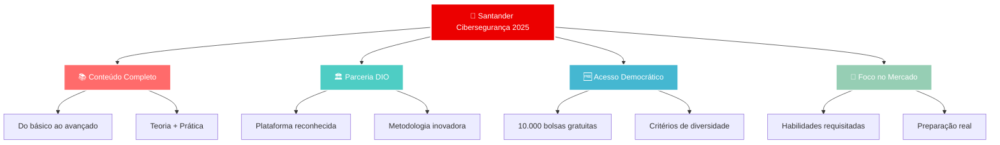

# SANTANDER CIBERSEGURANÇA 2025

### _Programa de Formação Completa em Segurança Digital_

 

---

## 🎯 **SOBRE O PROGRAMA**

O **Santander Cibersegurança 2025** é o programa ideal para quem deseja se destacar em uma das áreas mais promissoras da tecnologia, aprendendo a proteger sistemas, explorar vulnerabilidades e dominar técnicas essenciais de segurança digital.

### 🚀 **POR QUE ESCOLHER ESTE PROGRAMA?**

> _"Com uma trilha completa, o programa oferece uma formação prática e conectada às necessidades do mercado, ajudando a desenvolver as habilidades mais requisitadas em segurança digital."_

### ✅ **PRINCIPAIS VANTAGENS**

- 🎓 **Trilha completa** para iniciar ou se especializar na área de cibersegurança
- 🛠️ **Conteúdos práticos e teóricos** do básico aos conceitos avançados
- 🎯 **Testes de invasão** e análise de vulnerabilidades
- 💼 **Base sólida** para atuar protegendo dados, sistemas e redes
- 🌟 **Demandas reais** do mercado de trabalho

### 👥 **PÚBLICO ALVO**

- 🔰 **Iniciantes** em cibersegurança
- 🔄 **Profissionais em transição** de carreira
- 💻 **Entusiastas** da área de tecnologia
- 🎯 **Quem busca especialização** em segurança digital

### 📚 **ESTRUTURA DO PROGRAMA**

| 📖 **Componente**         | ⏱️ **Carga Horária** | 📋 **Descrição**                  |
| :------------------------ | :------------------: | :-------------------------------- |
| **Cursos Teóricos**       |         15h          | Fundamentos e conceitos avançados |
| **Laboratórios Práticos** |         12h          | Hands-on com ferramentas reais    |
| **Desafios de Código**    |          4h          | Projetos e simulações             |
| **🏆 TOTAL**              |       **31h**        | **Formação Completa**             |

### 🎖️ **DIFERENCIAIS DO PROGRAMA**

---

## 🔥 **DOCUMENTAÇÃO DOS LABORATÓRIOS PRÁTICOS**

_Esta seção documenta a implementação prática dos conceitos aprendidos no programa_

### 📋 **Sobre Esta Documentação**

Este repositório documenta um **laboratório completo de cibersegurança** desenvolvido como parte da formação do **Santander Cibersegurança 2025**. Aqui você encontrará a implementação prática de técnicas fundamentais de **penetration testing** em ambiente controlado, abrangendo desde a configuração do ambiente até a execução de ataques éticos.

### 🎯 **Objetivos dos Laboratórios**

- 🏗️ **Configurar ambiente isolado** para testes de segurança
- 🔍 **Demonstrar técnicas** de reconhecimento de rede
- ⚔️ **Executar ataques de força bruta** controlados
- 🛡️ **Desenvolver habilidades práticas** em cibersegurança
- ⚖️ **Promover práticas éticas** em segurança da informação

## 📚 Documentação Completa

### 🚀 Guia de Implementação

#### ⚔️ Ataque de Brute Force - [Documentação](/Santander%20-%20Cibersegurança%202025/Ataque%20Brute%20Force/README.md)

| Etapa   | Documento                                              | Descrição                                                                 | Status      |
| ------- | ------------------------------------------------------ | ------------------------------------------------------------------------- | ----------- |
| **1**   | [🛡️ Configuração do Ambiente](/Santander%20-%20Cibersegurança%202025/Ataque%20Brute%20Force/documents/1.ambiente.md)           | Setup completo do laboratório com VirtualBox, Kali Linux e Metasploitable | ✅ Completo |
| **2**   | [🔍 Varredura de Rede](/Santander%20-%20Cibersegurança%202025/Ataque%20Brute%20Force/documents/2.varreduraRede.md)             | Reconhecimento ativo e identificação de serviços vulneráveis              | ✅ Completo |
| **3**   | [⚔️ Ataque à Rede](/Santander%20-%20Cibersegurança%202025/Ataque%20Brute%20Force/documents/3.ataqueRede.md)                    | Implementação de ataques de força bruta contra serviços FTP               | ✅ Completo |
| **3.2** | [🌐 Ataque a Formulários Web](/Santander%20-%20Cibersegurança%202025/Ataque%20Brute%20Force/documents/3.2.formularioDVWA.md)   | Ataques de força bruta contra formulários de login em aplicações web      | ✅ Completo |
| **3.3** | [🔐 Password Spraying SMB](/Santander%20-%20Cibersegurança%202025/Ataque%20Brute%20Force/documents/3.3.passwordSprayingSMB.md) | Ataque em cadeia com enumeração SMB e password spraying automatizado      | ✅ Completo |

#### 🦠 Simulando Malware - [Documentação](/Santander%20-%20Cibersegurança%202025/Simulando%20Malware%20-%20Python/README.md)

---

 

## 🛠️ Tecnologias Utilizadas

### 🔧 Ferramentas Principais

| Ferramenta            | Versão | Propósito                   | Documentação                                                                          |
| --------------------- | ------ | --------------------------- | ------------------------------------------------------------------------------------- |
| **Oracle VirtualBox** | 7.0+   | Virtualização e isolamento  | [📖 Docs](https://www.virtualbox.org/manual/)                                         |
| **Kali Linux**        | 2024.x | Plataforma de pentesting    | [📖 Docs](https://www.kali.org/docs/)                                                 |
| **Metasploitable 2**  | 2.0.0  | Alvo vulnerável para testes | [📖 Guide](https://docs.rapid7.com/metasploit/metasploitable-2-exploitability-guide/) |

### ⚔️ Ferramentas de Ataque

| Ferramenta          | Propósito                      | Documentação                                                                    |
| ------------------- | ------------------------------ | ------------------------------------------------------------------------------- |
| **Nmap**            | Network scanning e discovery   | [📖 Manual](https://nmap.org/book/)                                             |
| **Medusa**          | Brute force attack tool        | [📖 Docs](http://foofus.net/goons/jmk/medusa/medusa.html)                       |
| **enum4linux**      | SMB/CIFS enumeration tool      | [📖 Manual](https://tools.kali.org/information-gathering/enum4linux)            |
| **smbclient**       | SMB/CIFS client for testing    | [📖 Manual](https://www.samba.org/samba/docs/current/man-html/smbclient.1.html) |
| **Developer Tools** | Browser-based HTTP analysis    | Built-in (F12)                                                                  |
| **FTP Client**      | File transfer protocol testing | Built-in                                                                        |
| **curl**            | HTTP request testing           | [📖 Manual](https://curl.se/docs/manpage.html)                                  |

---

## 🛡️ Considerações de Segurança

### ⚠️ **AVISOS CRÍTICOS**

> 🚨 **AMBIENTE CONTROLADO APENAS**
>
> Este laboratório deve ser executado **EXCLUSIVAMENTE** em ambiente isolado:
>
> - ✅ Rede Host-Only configurada
> - ✅ Sem acesso à internet das VMs
> - ✅ Firewall do host configurado
> - ❌ NUNCA em rede de produção

### 📋 Checklist de Segurança

- [ ] VMs isoladas em rede Host-Only
- [ ] Snapshots criados antes dos testes
- [ ] Monitoramento de conexões ativo
- [ ] Documentação de todas as ações

---

## 🎓 Aspectos Educacionais

### 📚 Conceitos Abordados

#### 🏗️ Infraestrutura e Ambiente

- **Virtualização** e isolamento de ambientes
- **Configuração de redes** Host-Only
- **Segmentação** e contenção de ataques

#### 🔍 Reconhecimento e Enumeração

- **Reconhecimento ativo** de redes
- **Varredura de portas** e identificação de serviços
- **Enumeração SMB/CIFS** com enum4linux
- **Descoberta de usuários** em sistemas Windows/Linux

#### ⚔️ Técnicas de Ataque

- **Ataques de força bruta** automatizados
- **Password spraying** vs brute force tradicional
- **Ataques a formulários web** (HTTP POST)
- **Exploração de protocolos** (FTP, SMB, HTTP)
- **Análise de requisições HTTP** com Developer Tools

#### 🛡️ Segurança Defensiva

- **Análise de vulnerabilidades** e classificação OWASP
- **Contramedidas defensivas** por protocolo
- **Monitoramento e detecção** de ataques
- **Implementação de controles** de segurança

### 🔍 Técnicas Demonstradas

#### 🌐 Network e Protocol Analysis

- **Network scanning** com Nmap
- **SMB enumeration** com enum4linux e smbclient
- **HTTP analysis** com Developer Tools (F12)
- **Protocol exploitation** em múltiplas camadas

#### 🔐 Authentication Attacks

- **Brute force attacks** com Medusa (FTP, HTTP, SMB)
- **Password spraying** para evitar bloqueios
- **Credential validation** e teste de acesso
- **Wordlist creation** e customização estratégica

#### 📊 Analysis e Intelligence

- **Log analysis** e incident response
- **Results interpretation** de ferramentas de pentest
- **Vulnerability assessment** e classificação de riscos
- **Attack chain planning** e execução sequencial

#### 🛠️ Tool Mastery

- **Command-line proficiency** em ambiente Linux
- **Automation scripting** para ataques em massa
- **Multi-protocol testing** com diferentes ferramentas
- **Stealth techniques** para evitar detecção

### 🏆 Competências Desenvolvidas

#### 🔧 Competências Técnicas

- **Configuração de laboratórios** de segurança
- **Uso profissional** de ferramentas de pentesting
- **Análise de resultados** de varredura e ataques
- **Interpretação de logs** de segurança
- **Documentação técnica** profissional

#### 🧠 Competências Analíticas

- **Pensamento estratégico** em cibersegurança
- **Análise de riscos** e priorização de vulnerabilidades
- **Correlação de informações** entre diferentes fontes
- **Assessment methodology** estruturada

#### 🎯 Competências Específicas por Protocolo

- **FTP Security**: Configuração segura e testes de penetração
- **Web Application Security**: Análise de formulários e OWASP Top 10
- **SMB/CIFS Security**: Enumeração, spraying e hardening
- **Network Security**: Segmentação, monitoramento e resposta

#### 🛡️ Competências Defensivas

- **Incident response** e análise forense
- **Security monitoring** e detecção de anomalias
- **Hardening** de sistemas e serviços
- **Security awareness** e treinamento

---

### 🙏 Agradecimentos

- **Programa Santander 2025** - Pela oportunidade de desenvolvimento
- **DIO** - Pelo desenvolvimento do curso e ensinamentos
- **Comunidade Kali Linux** - Pelas ferramentas e documentação
- **Rapid7** - Pelo Metasploitable como ambiente de treinamento
- **Comunidade de Cibersegurança** - Pelo conhecimento compartilhado

---

### 🎯 **Laboratório Pronto para Uso!**

**[🚀 Começar Agora](/Santander%20-%20Cibersegurança%202025/Ataque%20Brute%20Force/documents/1.ambiente.md)** | **[📚 Documentação](/Santander%20-%20Cibersegurança%202025/Ataque%20Brute%20Force/documents/2.varreduraRede.md)** | **[⚔️ Ataques](/Santander%20-%20Cibersegurança%202025/Ataque%20Brute%20Force/documents/3.ataqueRede.md)** | **[🌐 Web Attacks](/Santander%20-%20Cibersegurança%202025/Ataque%20Brute%20Force/documents/3.2.formularioDVWA.md)** | **[🔐 SMB Attacks](/Santander%20-%20Cibersegurança%202025/Ataque%20Brute%20Force/documents/3.3.passwordSprayingSMB.md)**

---

**Desenvolvido com ❤️ para educação em cibersegurança**

 

